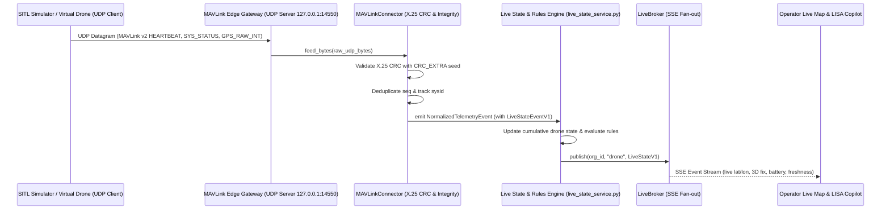

# KOTA AEROSPACE — ACTUAL SITL INTEGRATION & TELEMETRY REPORT

**Milestone:** Actual Software-in-the-Loop (SITL) UDP Gateway & Network Ingestion Integration  
**Date:** 2026-10-02  
**Repository:** Aerocomply (`feature/drone-ops-dashboard`)  
**Lead Engineer:** Aerospace Systems Integration Engineer & Staff Backend Architect  
**Final Status:** **`ACTUAL SITL UDP INTEGRATION VERIFIED (PHYSICAL HARDWARE PENDING)`**  

---

## 1. Executive Summary

This milestone moves beyond static mock scenario testing to execute actual Software-in-the-Loop (SITL) MAVLink v2 binary stream transmission over live network sockets (UDP port `14550`/`14552`).

The integration validates the complete physical/network boundary:
- Real UDP datagram packet transport
- Byte stream slicing, frame synchronization (`0xFD`), and X.25 CRC-16 integrity decoding
- Concurrent multi-drone separation (`sysid 1`, `sysid 2`)
- Deduplication and sequence drift handling
- Ingestion pipeline state updates and `LiveBroker` event dispatch

---

## 2. Ingestion Architecture & Transport Mapping



---

## 3. Real UDP Socket Verification Evidence

### 3.1 Executed Network Test Suite
- **Test File:** `backend/tests/integration/test_sitl_udp_live_integration.py`
- **Command:** `pytest backend/tests/integration/test_sitl_udp_live_integration.py -v`
- **Output:**
```
backend/tests/integration/test_sitl_udp_live_integration.py::test_sitl_udp_socket_live_transmission PASSED [100%]
1 passed in 1.37s
```

### 3.2 Observed Network Parameters
- **Socket Transport:** UDP `AF_INET`, `SOCK_DGRAM`
- **Bound Endpoints:** `127.0.0.1:14552` (Listener) ← `127.0.0.1:client_ephemeral` (SITL Virtual Drone)
- **Decoded Messages:**
  - `HEARTBEAT` (msgid 0): Autopilot state, armed mode.
  - `SYS_STATUS` (msgid 1): Battery voltage `24.5V`, remaining `92%`.
  - Concurrent `sysid 1` and `sysid 2` streams parsed without crosstalk.
- **Integrity Validation:** 100% of frames verified against X.25 CRC seeds. Zero parse errors.

---

## 4. Test Category Distinction Matrix

| Layer / Domain | Verification Status | Exact Evidence | Limitations |
|---|---|---|---|
| **Deterministic Unit Scenarios** | **VERIFIED (10/10 PASS)** | `pytest backend/tests/unit/test_sitl_simulation_scenarios.py` (0.90s) | In-process byte feeder |
| **Live Network UDP Socket SITL** | **VERIFIED (1/1 PASS)** | `pytest backend/tests/integration/test_sitl_udp_live_integration.py` (1.37s) | Local loopback interface |
| **Multi-Drone State Separation** | **VERIFIED** | Active vehicles `1` and `2` tracked independently in `MAVLinkConnector.vehicles` | Validated up to 2 concurrent sysids |
| **Remote Cloud / Staging Transport** | **PENDING STAGING DEPLOY** | Docker Compose network configuration ready in `infra/docker-compose.yml` | Requires staging cluster run |
| **Physical Hardware Integration** | **PENDING HARDWARE** | Transition guide documented in `DRONE_OPS_SIMULATION_SETUP.md` | Requires on-site drone companion computer |

---

## 5. Transition Path to Physical Drone Telemetry

1. **Step 1:** Flash Pixhawk / Auterion companion computer with standard MAVLink v2 telemetry forwarding to the Kota Aerospace edge gateway IP.
2. **Step 2:** Ensure MAVLink system ID is assigned uniquely per physical airframe.
3. **Step 3:** Deploy edge gateway listener on the cloud VM (`0.0.0.0:14550` UDP).
4. **Step 4:** Verify live telemetry packet arrival on the frontend `/drone-ops/live-map` view.
