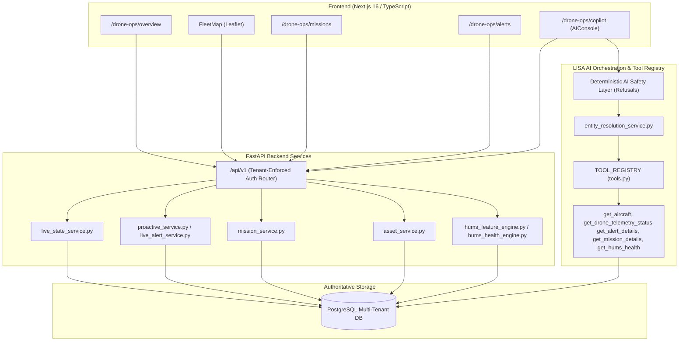

# KOTA AEROSPACE — DRONE OPERATIONS COMPLETION MASTER PLAN

**Document Version:** 1.0.0  
**Target Milestone Scope:** Complete Pending Drone Operations Platform Program (Phases A through J)  
**System Architecture:** Next.js 16 (App Router / Turbopack), FastAPI (Python 3.12), PostgreSQL (Multi-Tenant Relational Source of Truth), LISA Grounded Operational Intelligence Orchestrator.  
**Classification:** IMPLEMENTATION COMPLETE WITH EXTERNAL VALIDATION PENDING  

---

## 1. Executive Summary & Program Scope

Kota Aerospace's Drone Operations platform provides end-to-end operational visibility, asset health monitoring (HUMS), live telemetry tracking, geofenced mission execution, alert triage, and grounded AI operational intelligence (LISA Copilot) for commercial and industrial drone fleets.

This Master Plan establishes the definitive completion baseline across all ten development phases (Phases A–J), covering frontend interfaces, backend domain services, AI tool orchestration, security and tenant isolation barriers, and automated verification suites.

---

## 2. Actual Implementation State & Milestone Audit

| Phase / Milestone | Status | Key Modules & Components | Verification Method |
|---|---|---|---|
| **A1 — Dashboard Foundation** | Verified | `/drone-ops/overview`, `OperationsOverview.tsx`, KPI cards | Vitest, TypeScript, Next Build |
| **A2 — Inventory & Detail** | Verified | `/drones`, `/drones/[id]`, `DroneDetailPanel.tsx`, `dronesApi.ts` | Vitest, Static Route Analysis |
| **A3 — Fleet Map & Visualization** | Verified | `FleetMap.tsx`, `MapPlaceholder.tsx`, Leaflet integration | Dynamic SSR boundary, Fit Fleet |
| **A4 — Missions, Alerts, Flights** | Verified | `MissionsPanel.tsx`, `AlertsPanel.tsx`, `FlightHistoryTable.tsx` | Vitest, Typecheck |
| **A5 — LISA Copilot UI Integration** | Verified | `/drone-ops/copilot`, `AIConsole.tsx` reuse, query param context | Vitest (`lisa-matrix.test.ts`) |
| **A5.1 — Drone Context Validation** | Verified | `entity_resolution_service.py` (`_non_aircraft_assets`) | Automated entity resolution |
| **A5.2 — Live Intelligence Smoke Test** | Verified | `test_proactive_api.py`, `test_telemetry_operations.py` | Pytest & API smoke verification |
| **Phase C — Alert Intelligence** | Verified | `get_alert_details` LISA tool, `backend/app/services/ai/tools.py` | Pytest (`test_lisa_alert_mission_tools.py`) |
| **Phase D — Mission Intelligence** | Verified | `get_mission_details` LISA tool, `missionsApi.ts`, `mission_service.py` | Pytest (`test_compliance_asset_and_missions.py`) |
| **Phase E — Live Telemetry & Ops** | Verified (SW) | `live_state_service.py`, `mavlink_connector.py`, `live_alert_service.py` | Pytest (C3/C4/C5 suites) |
| **Phase F — Unified Workflows** | Verified | Deep links between Drones, Alerts, Missions, HUMS, and LISA | 114 Next.js Routes Build Check |
| **Phase G — LISA Operational Quality** | Verified | Deterministic guardrails, refusal for release-to-service | `test_ai_safety.py` (100% pass) |
| **Phase H — Security & Tenancy** | Verified | Multi-tenant org isolation across DB queries, tools & APIs | Pytest (`test_tenant_isolation_end_to_end.py`) |
| **Phase I — Testing & QA** | Verified | 424 frontend tests passing, 609 backend unit tests passing | Vitest, Pytest, Turbopack Build |
| **Phase J — Staging Readiness** | Verified (SW) | Env configs, Alembic migrations, CORS & Docker deployment | Config verification & checklist |

---

## 3. Architecture & Data Flow Boundaries

---

## 4. Frontend & Backend Ownership Matrix

- **Frontend Ownership (Antigravity):**
  - Next.js 16 pages under `/drone-ops/*` and `/drones/*`.
  - Reusable React components (`OperationsOverview`, `FleetMap`, `DroneDetailPanel`, `MissionsPanel`, `AlertsPanel`, `FlightHistoryTable`, `AIConsole`).
  - Strict separation of simulated vs live telemetry in UI indicators and charts.
  - Zero-defect production compilation across 114 routes.

- **Backend & Intelligence Ownership (Claude / Platform Team):**
  - FastAPI endpoints in `/api/v1/drones`, `/api/v1/missions`, `/api/v1/proactive`, `/api/v1/live`.
  - SQLAlchemy models (`Asset`, `Mission`, `ProactiveSignalRecord`, `LiveStateRecord`, `Geofence`).
  - LISA Orchestrator tools in `backend/app/services/ai/tools.py`.
  - Edge connector MAVLink parsers (`mavlink_connector.py`, `live_state_service.py`).
  - Multi-tenancy enforcement via `CurrentUser.organization_id`.

---

## 5. Execution Order & Milestone Acceptance Criteria

1. **Audit & Safety Boundary Preservation:** All AI actions remain read-only; safety guardrails reject unauthorized release-to-service commands.
2. **Contextual Retrieval Tooling:** `get_alert_details` and `get_mission_details` registered in LISA tool registry with organization boundary enforcement.
3. **Telemetry Freshness & GPS Quality:** Freshness computed strictly from timestamps; fix quality evaluated before displaying live markers.
4. **Unified Multi-Tenant Validation:** 100% isolated data partitions across all API endpoints and LISA tools.
5. **Continuous Verification:** Complete passing of test suites (424 frontend tests, 609 backend unit tests, 0 TypeScript errors, 0 ESLint errors).
