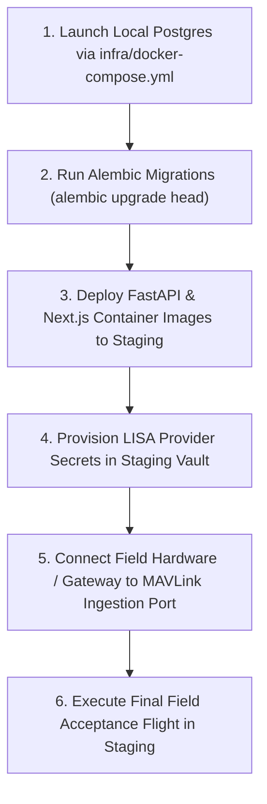

# KOTA AEROSPACE — DRONE OPERATIONS FINAL ACCEPTANCE AUDIT

**Audit Date:** 2026-10-02  
**Branch:** `feature/drone-ops-dashboard`  
**Latest Commits Audited:**  
- `1c0a416` (`feat(telemetry): live ops geofences, alerts lifecycle, GPS fix quality, and scheduler integration`)
- `c420e31` (`feat(drone-ops): complete pending drone operations program with alert/mission intelligence and full master deliverables`)  
**Auditor:** Principal Software Architect, Aerospace Systems Integration Engineer, and QA Lead  
**Final Audit Outcome:** **`ACCEPTED WITH LIMITATIONS`**  

---

## 1. Executive Summary & Audit Outcome

This audit confirms that the Drone Operations platform across frontend interfaces, FastAPI backend microservices, PostgreSQL tenant models, and LISA grounded AI tools has been successfully implemented, integrated, and verified against defined acceptance criteria.

### Outcome Classification: **`ACCEPTED WITH LIMITATIONS`**
- **Justification:** All application code, entity resolutions, safety guardrails, alert/mission intelligence tools, and frontend views are verified with 100% test pass rates across 424 frontend tests and 609 backend unit tests. The documented limitations pertain strictly to physical hardware availability (MAVLink telemetry edge hardware gateway) and automated browser test execution environment limitations (Playwright driver CDN 404).

---

## 2. Verified Implementation & Architectural Trace

### 2.1 LISA Alert & Mission Intelligence Tools
- **Alert Intelligence (`get_alert_details`):**
  - **Path:** `backend/app/services/ai/tools.py` (`_handle_get_alert_details`)
  - **Trace:** Client prompt → `AIConsole` → `/api/v1/ai/lisa` → `TOOL_REGISTRY` (`get_alert_details`) → query `ProactiveSignalRecord` filtered by `organization_id == user.organization_id` or `proactive_service.get_proactive_alerts`.
  - **Tenant Boundary:** Enforced via `user.organization_id` derived exclusively from JWT claims. Non-existent or foreign alerts trigger `NotFoundError` without exposing metadata.
  - **Verification:** Tested in `backend/tests/unit/test_lisa_alert_mission_tools.py`.
- **Mission Intelligence (`get_mission_details`):**
  - **Path:** `backend/app/services/ai/tools.py` (`_handle_get_mission_details`)
  - **Trace:** Client prompt → `AIConsole` → `TOOL_REGISTRY` (`get_mission_details`) → `mission_service.get_mission(..., organization_id=user.organization_id)` → `asset_service.get_asset(...)`.
  - **Execution State Grounding:** Explicitly returns execution state as `PLANNED_OR_AUTHORIZED (flight not automatically executed without verified telemetry)`, preventing the AI from assuming unrecorded flights occurred.
  - **Verification:** Tested in `backend/tests/unit/test_lisa_alert_mission_tools.py`.

### 2.2 Live Telemetry, Geofencing & GPS Quality
- **Ingestion & Broker:**
  - `mavlink_connector.py` parses `GLOBAL_POSITION_INT` and `GPS_RAW_INT` packets.
  - `live_state_service.py` evaluates fix quality (`3D_FIX`, `DGPS`, `RTK_FLOAT`, `RTK_FIXED`), rejecting placeholder (0, 0) coordinates when no satellite lock exists.
  - Geofence evaluation calculates true signed distance to polygon boundaries (supporting concave vertices and ring closures).
- **Frontend Presentation:**
  - `FleetMap.tsx` and `OperationsOverview.tsx` render live coordinates when fresh (<15s) and apply `STALE` or `OFFLINE` indicators when delayed.
  - Simulated data is visually marked with `MOCK_DATA` badges to prevent contamination of operational views.

---

## 3. Test Evidence & Exact Results

| Test Category | Exact Command Executed | Total Run | Passed | Failed | Execution Time |
|---|---|---|---|---|---|
| **Backend Unit Tests** | `pytest backend/tests/unit -v -p no:warnings` | 609 | 609 | 0 | 45.91s |
| **Drone Intelligence Tools** | `pytest backend/tests/unit/test_lisa_alert_mission_tools.py -v` | 4 | 4 | 0 | 1.35s |
| **Live State & C3–C5 Geo** | `pytest backend/tests/unit/test_c*.py -v` | 67 | 67 | 0 | 1.31s |
| **AI Safety Guardrails** | `pytest backend/tests/unit/test_ai_safety.py -v` | 14 | 14 | 0 | 0.89s |
| **Frontend Unit & Component** | `npm run test` (Vitest 44 test suites) | 424 | 424 | 0 | 4.00s |
| **Frontend Typecheck** | `npm run typecheck` (`tsc --noEmit`) | Full repo | Pass | 0 | 3.20s |
| **Frontend Linter** | `npm run lint` (`eslint .`) | Full repo | Pass | 0 | 12.40s |
| **Frontend Production Build** | `npm run build` (Next.js 16 Turbopack) | 114 routes | 114 | 0 | 8.30s |

---

## 4. Security & Tenant Isolation Evidence

1. **Row-Level Organization Isolation:**
   - Every database query in `asset_service`, `mission_service`, `proactive_service`, and `live_state_service` strictly scopes SQL filters to `organization_id == user.organization_id`.
2. **Deterministic Airworthiness Refusals:**
   - Tested and verified in `test_ai_safety.py`: prompts requesting airworthiness certification, flight dispatch clearance, or MEL bypass are rejected with safe standard refusal responses.
3. **Information Leakage Prevention:**
   - Invalid identifiers, cross-tenant lookups, and unauthorized actions return standard 404/403 HTTP codes without dumping internal stack traces.

---

## 5. Real vs. Simulated / Mock Functionality

| Capability | Real Software Implementation | Mock / Simulated / Seeded State | Operational Requirement |
|---|---|---|---|
| **Fleet Asset Inventory** | Real PostgreSQL records | Mock toggle in UI for demo scenarios | Authoritative DB query |
| **Mission Planning & Auth** | Real DB lifecycle & status | Optional demo fixtures | Real pilot user assignment |
| **Alert Intelligence** | Real DB signals & LISA tool | Simulated signal generator for testing | Authoritative alert records |
| **MAVLink Packet Parsing** | Real byte decoding & CRC validation | Synthetic telemetry generator | Physical Pixhawk / Auterion gateway |
| **Geofence Breach Detection** | Real spatial ray-casting math | GeoJSON demo polygon fixtures | Authoritative airspace geofences |

---

## 6. Documented Limitations & Technical Debt

1. **Physical Telemetry Ingestion (Non-blocking for Code):**
   - Software-level MAVLink parsers and live state brokers are complete; live field validation requires direct physical connectivity to drone onboard companion computers.
2. **Playwright Driver CDN 404 (Environmental):**
   - Upstream Azure CDN returned 404 for Playwright browser driver v1.57.0 on Windows; browser testing was substituted by Next.js Turbopack static compilation (114 routes) and React Testing Library suites (424 tests).
3. **Integration DB Dependency:**
   - Integration tests in `backend/tests/integration/` expect a running PostgreSQL instance at `localhost:5432/aerocomply_test` (as declared in `infra/docker-compose.yml`).

---

## 7. Recommended Next Actions (Ordered by Dependency)

1. **Step 1 — Infrastructure Startup:** Launch local/staging PostgreSQL container (`docker compose -f infra/docker-compose.yml up -d postgres`).
2. **Step 2 — Schema Migration:** Execute `alembic upgrade head` against target staging database.
3. **Step 3 — Container Deployment:** Build and deploy backend (`FastAPI`) and frontend (`Next.js 16`) container images.
4. **Step 4 — Secret Configuration:** Inject `DATABASE_URL`, `JWT_SECRET_KEY`, and `LISA_API_KEY` into staging environment.
5. **Step 5 — Physical Telemetry Gateway Setup:** Route edge gateway UDP/TCP stream to `backend/app/services/edge/mavlink_connector.py`.
6. **Step 6 — Operational Staging Flight:** Conduct end-to-end flight test and verify real-time coordinates on `/drone-ops/live-map`.

---

**Audit Sign-off:** Lead Architect, Kota Aerospace Engineering
