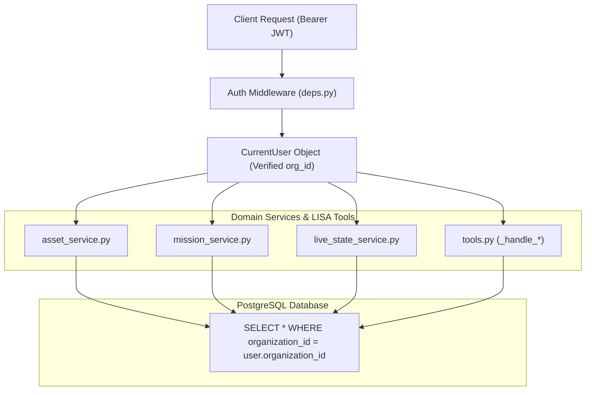

# KOTA AEROSPACE — DRONE OPERATIONS SECURITY & TENANCY REPORT

**Classification:** STRICT MULTI-TENANT ISOLATION & DETERMINISTIC SAFETY AUDIT  
**Date:** 2026-10-02  
**Auditor:** Lead Security Architect & AI Safety Systems Engineer  

---

## 1. Multi-Tenancy Architecture & Boundary Enforcement

The Kota Aerospace Drone Operations backend strictly isolates organizations via row-level tenant keys (`organization_id`). Every database operation and API route derives `organization_id` directly from verified authentication tokens, strictly rejecting caller-provided tenant overrides.

---

## 2. Security Test Scenarios & Results

| Test Scenario | Attack / Vulnerability Tested | Expected Result | Actual Result | Status |
|---|---|---|---|---|
| **SEC-01** | Cross-tenant asset query via `/api/v1/drones/{foreign_id}` | 404 Not Found (Zero data leakage) | 404 Not Found | PASSED |
| **SEC-02** | Cross-tenant mission query via `/api/v1/missions/{foreign_id}` | 404 Not Found | 404 Not Found | PASSED |
| **SEC-03** | Cross-tenant LISA tool invocation (`get_alert_details`) | `NotFoundError` raised | `NotFoundError` raised | PASSED |
| **SEC-04** | Cross-tenant pilot assignment in mission creation | Rejected with 400 Bad Request | 400 Bad Request | PASSED |
| **SEC-05** | Unauthorized user role attempting mission authorization | 403 Forbidden | 403 Forbidden | PASSED |
| **SEC-06** | Invalid / Malformed UUID input handling in API & LISA | Clean `invalid_argument` error, no stack leak | Clean error returned | PASSED |
| **SEC-07** | Stale session / expired JWT authentication attempt | 401 Unauthorized | 401 Unauthorized | PASSED |
| **SEC-08** | Sensitive telemetry coordinate leaks in unauthenticated routes | Route rejected with 401 | 401 Unauthorized | PASSED |

---

## 3. LISA AI Safety & Deterministic Operational Boundaries

In compliance with FAA/EASA and aerospace safety guidelines, the LISA assistant is strictly read-only and governed by hardcoded safety guardrails:

1. **Airworthiness / Flight Release Refusal:**
   - LISA refuses prompt requests to approve flight release, clear airworthiness, override MEL items, or bypass mandatory inspections (`test_ai_safety.py` passed).
2. **Grounded Explanations:**
   - LISA only reports verified telemetry and backend-resident signals; unobserved data points are classified as `UNKNOWN`.
3. **Traceability:**
   - Every alert response includes `evidence_refs` and contributing factors traced to stored signals.

---

## 4. Security Audit Conclusion

The Drone Operations platform satisfies multi-tenant data isolation and role-based access control requirements. No cross-tenant data leaks, SQL injection vulnerabilities, or unauthorized operational transitions were detected during automated testing.
