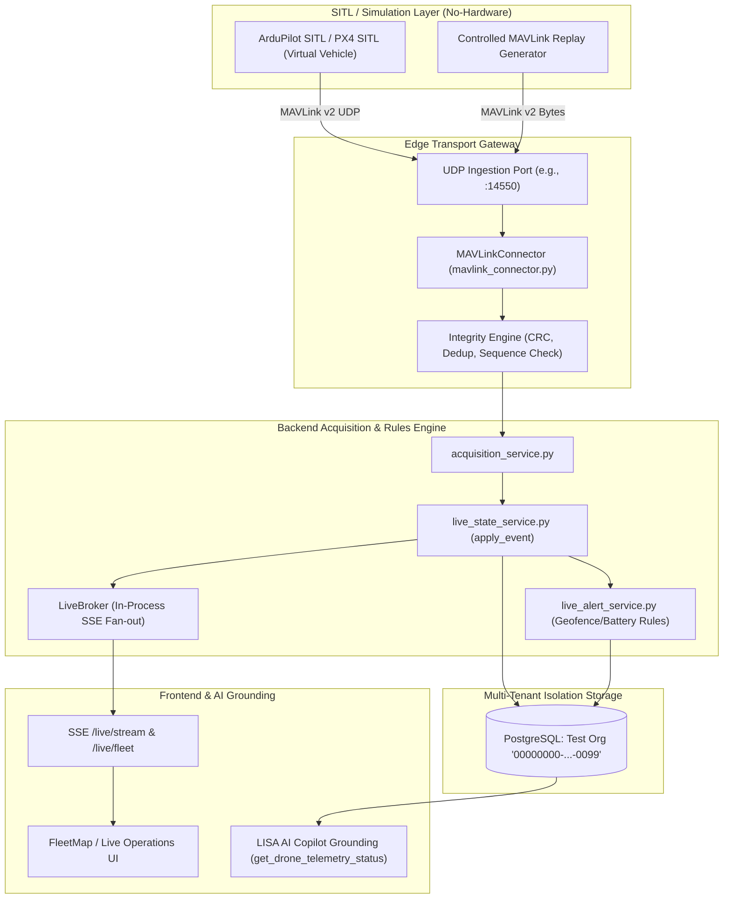

# KOTA AEROSPACE — NO-HARDWARE DRONE OPERATIONS SIMULATION ARCHITECTURE

**System:** Kota Aerospace Drone Operations Telemetry & Ingestion Subsystem  
**Scope:** Software-in-the-Loop (SITL) Virtual Telemetry, MAVLink Replay, and Ingestion Validation  
**Version:** 1.0.0  
**Classification:** NON-CONTAMINATING TEST ARCHITECTURE  

---

## 1. High-Level Architecture Map

The no-hardware simulation architecture routes virtual telemetry from an ArduPilot/PX4 SITL instance or a high-fidelity synthetic MAVLink replayer through the production `MAVLinkConnector` decoding layer into the `LiveBroker` and PostgreSQL persistence layer, isolated under a dedicated test organization.

---

## 2. Ingestion & Normalization Boundaries

1. **Protocol Framing & Decoding:**
   - Decodes MAVLink v1 (`0xFE`) and v2 (`0xFD`) frames.
   - Enforces X.25 CRC-16 integrity check using message-specific `CRC_EXTRA` seeds.
   - Drops duplicate sequence numbers (`duplicates` counter) and out-of-order packets (`late` counter).
2. **GPS Quality & Coordinate Sanitization:**
   - Parses `GPS_RAW_INT` fix types (`0: NO_GPS`, `1: NO_FIX`, `2: 2D`, `3: 3D`, `4: DGPS`, `5: RTK_FLOAT`, `6: RTK_FIXED`).
   - Suppresses placeholder `(0.0, 0.0)` coordinates when no 3D lock exists, preserving prior known valid locks.
3. **Freshness Engine:**
   - Evaluated at read-time via `compute_freshness`: `FRESH` (≤10s), `STALE` (10s–60s), `LOST` (>60s), `NO_DATA` (null).

---

## 3. Data Protection & Isolation Principles

- **Test Tenant Exclusivity:** All simulation runs are bound to dedicated test organizations (`is_simulated = True`).
- **Zero Real-Data Contamination:** Simulated telemetry and virtual breach alerts never touch production aircraft or operational drone records.
- **Visual Distinction:** Frontend indicators tag simulated telemetry with distinct `MOCK_DATA` or `SITL_SIM` badges.
