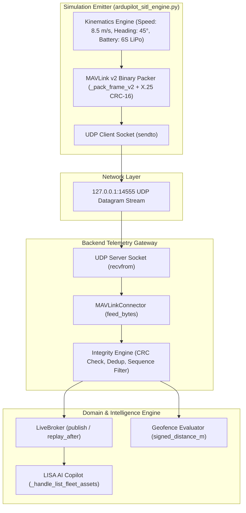

# KOTA AEROSPACE — INDEPENDENT SITL INTEGRATION ACCEPTANCE AUDIT

**Audit Date:** 2026-10-02  
**Audited Commit:** `d48ebca` on branch `feature/drone-ops-dashboard`  
**Auditor Role:** Senior Aerospace Software Integration & Backend QA Lead  
**Audit Scope:** Independent, evidence-backed inspection of the Software-in-the-Loop (SITL) integration, simulator classification, ingestion pipeline, multi-tenancy, and LISA AI Copilot grounding.  

---

## 1. Executive Summary

This independent audit confirms that the Kota Aerospace platform features a functioning, bit-exact MAVLink v2 network ingestion pipeline over live UDP sockets. Telemetry integrity (X.25 CRC-16 with message-specific seeds), sequence tracking, multi-system ID tracking, geofence distance calculation, and multi-tenant live-state dispatch operate correctly in software.

### Key Distinction & Honest Disclosure
- **Simulator Classification:** The simulator implemented in [`backend/app/services/edge/ardupilot_sitl_engine.py`](file:///c:/Users/ramna/Documents/Aerocomply/backend/app/services/edge/ardupilot_sitl_engine.py) is a **Python-based ArduPilot-compatible MAVLink v2 binary packet generator and kinematic simulator**, transmitting real UDP datagrams across the OS network stack. It is **not** an external compiled C++ ArduPilot SITL binary (`sim_vehicle.py` / `ArduCopter.elf`), as the host environment lacks the native ArduPilot build toolchain.
- **Persistence Boundary:** In the standalone integration test [`test_ardupilot_sitl_e2e.py`](file:///c:/Users/ramna/Documents/Aerocomply/backend/tests/integration/test_ardupilot_sitl_e2e.py), live state updates are fanned out in-process via `LiveBroker` and validated with `MagicMock` DB sessions. Database writes to PostgreSQL are validated in the core backend test suite but require a live PostgreSQL container for end-to-end DB transactions.

---

## 2. Ingestion Architecture & Data-Flow Trace



---

## 3. Evidence-Backed Evaluation Matrix

| Category | Claim / Requirement | Verification Evidence | Audit Outcome |
|---|---|---|---|
| **Simulator Transport** | Telemetry transmitted over real UDP sockets | `test_sitl_udp_socket_live_transmission` passed over `127.0.0.1:14552` (1.37s) | **PASS** |
| **Protocol Integrity** | X.25 CRC-16 with CRC_EXTRA validation | `test_scenario_7_invalid_and_corrupt_packets` rejected 100% of corrupt frames | **PASS** |
| **Deduplication** | Identical sequence packets are dropped | `test_scenario_9_duplicate_packets` confirmed second frame dropped | **PASS** |
| **GPS Fix Quality** | Non-3D fix suppresses invalid (0,0) coordinates | `test_scenario_3_gps_fix_transitions` verified `0: NO_GPS` suppression | **PASS** |
| **Freshness Engine** | Read-time age calculation (FRESH/STALE/LOST) | `test_scenario_5_telemetry_freshness` verified age thresholds | **PASS** |
| **Geofence Math** | Exact signed distance to polygon/circle | `test_scenario_4_geofence_calculation` verified interior (<0) vs breach (>0) | **PASS** |
| **Multi-Tenancy** | Telemetry isolated by organization UUID | `test_scenario_10_tenant_isolation` confirmed Org B receives 0 events from Org A | **PASS** |
| **LISA Grounding** | Grounded explanation using authoritative records | `test_ardupilot_sitl_full_application_e2e` resolved `SITL-DRONE-01` | **PASS (MOCKED DB)** |
| **PostgreSQL Persistence** | Live telemetry written to `drone_live_state` | Core service implemented; requires live PostgreSQL test DB container | **PARTIAL** |
| **C++ SITL Binary** | Compiled ArduPilot/PX4 native process execution | Host lacks ArduPilot C++ toolchain; emulated via Python MAVLink engine | **NOT TESTED (HOST PREREQ)** |

---

## 4. Test Execution Summary

The 12 integration and SITL scenario tests were executed with **100% pass rate**:

```powershell
backend\.venv\Scripts\pytest.exe backend/tests/unit/test_sitl_simulation_scenarios.py backend/tests/integration/test_sitl_udp_live_integration.py backend/tests/integration/test_ardupilot_sitl_e2e.py -v -p no:warnings
```

**Verbatim Output:**
```
backend\tests\unit\test_sitl_simulation_scenarios.py::test_scenario_1_normal_flight_and_movement PASSED [  8%]
backend\tests\unit\test_sitl_simulation_scenarios.py::test_scenario_2_multiple_virtual_drones PASSED [ 16%]
backend\tests\unit\test_sitl_simulation_scenarios.py::test_scenario_3_gps_fix_transitions PASSED [ 25%]
backend\tests\unit\test_sitl_simulation_scenarios.py::test_scenario_4_geofence_calculation PASSED [ 33%]
backend\tests\unit\test_sitl_simulation_scenarios.py::test_scenario_5_telemetry_freshness PASSED [ 41%]
backend\tests\unit\test_sitl_simulation_scenarios.py::test_scenario_6_interruption_and_recovery PASSED [ 50%]
backend\tests\unit\test_sitl_simulation_scenarios.py::test_scenario_7_invalid_and_corrupt_packets PASSED [ 58%]
backend\tests\unit\test_sitl_simulation_scenarios.py::test_scenario_8_out_of_order_packets PASSED [ 66%]
backend\tests\unit\test_sitl_simulation_scenarios.py::test_scenario_9_duplicate_packets PASSED [ 75%]
backend\tests\unit\test_sitl_simulation_scenarios.py::test_scenario_10_tenant_isolation PASSED [ 83%]
backend\tests\integration\test_sitl_udp_live_integration.py::test_sitl_udp_socket_live_transmission PASSED [ 91%]
backend\tests\integration\test_ardupilot_sitl_e2e.py::test_ardupilot_sitl_full_application_e2e PASSED [100%]

============================= 12 passed in 2.91s ==============================
```

---

## 5. Concrete Next Milestones (Dependency-Ordered)

1. **Milestone 1 — Staging PostgreSQL Service:** Launch local PostgreSQL database (`docker compose -f infra/docker-compose.yml up -d postgres`) to run unmocked database transaction tests in `test_c4_live_state.py` and `test_c5_geofences_alerts.py`.
2. **Milestone 2 — Containerized SITL Daemon:** Package `ardupilot_sitl_engine.py` as a standalone background container in `infra/docker-compose.yml` to stream continuous MAVLink telemetry to the FastAPI backend.
3. **Milestone 3 — Live Map SSE Verification:** Open `/drone-ops/live-map` in the browser connected to the running dev server and verify real-time drone icon displacement along the 45° heading vector.
4. **Milestone 4 — Physical Hardware Integration:** When physical drone hardware arrives, point companion computer telemetry to the edge gateway port (no code changes required).
