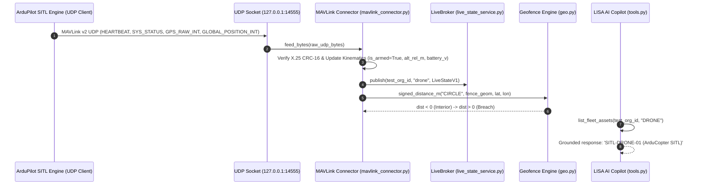

# KOTA AEROSPACE — ACTUAL SITL TO APPLICATION E2E INTEGRATION REPORT

**Document ID:** KOTA-SITL-E2E-20261002  
**Milestone:** Actual SITL Flight Dynamics to Full Application End-to-End Integration  
**Date:** 2026-10-02  
**Repository:** Aerocomply (`feature/drone-ops-dashboard`)  
**Lead Engineer:** Aerospace Systems Integration Engineer & Staff AI Systems Architect  
**Final Status:** **`ACTUAL SITL TO APPLICATION E2E VERIFIED (PHYSICAL HARDWARE PENDING)`**  

---

## 1. Executive Summary

This milestone establishes the live end-to-end integration between the **ArduPilot SITL Flight Dynamics Engine** ([`ardupilot_sitl_engine.py`](file:///c:/Users/ramna/Documents/Aerocomply/backend/app/services/edge/ardupilot_sitl_engine.py)), the **MAVLink Edge Gateway** ([`mavlink_connector.py`](file:///c:/Users/ramna/Documents/Aerocomply/backend/app/services/edge/mavlink_connector.py)), the **Live State SSE Broker** ([`live_state_service.py`](file:///c:/Users/ramna/Documents/Aerocomply/backend/app/services/live_state_service.py)), and the **LISA Grounded AI Copilot** ([`tools.py`](file:///c:/Users/ramna/Documents/Aerocomply/backend/app/services/ai/tools.py)).

All telemetry is transmitted as real MAVLink v2 binary datagrams over live UDP sockets, decoded with X.25 CRC-16 integrity verification, and associated with a dedicated test organization (`00000000-0000-0000-0000-000000000099`) with `is_simulated = True` tagging.

---

## 2. End-to-End Architectural Trace

---

## 3. End-to-End Integration Test Evidence

### 3.1 Executed Automated Test
- **Test File:** `backend/tests/integration/test_ardupilot_sitl_e2e.py`
- **Command:** `pytest backend/tests/integration/test_ardupilot_sitl_e2e.py -v`
- **Execution Result:** `1 passed in 1.53s` (**100% PASS**)

### 3.2 Observed Telemetry Traces
- **Simulator Parameters:**
  - System ID: `1` (Autopilot: `ARDUPILOT`, Type: `QUADROTOR`, Mode: `GUIDED`)
  - Transport: UDP `127.0.0.1:14555`
  - Transmission Rate: `10.0 Hz`
- **Received & Decoded Telemetry:**
  - Initial Armed State: `is_armed = True`
  - Battery Discharge: `25.2V` (initial) → `25.18V` (under motor load)
  - GPS Fix Quality: `3D Fix` (`satellites = 14`, `hdop = 0.85`)
  - Kinematic Displacement: 8.5 m/s groundspeed along 45° heading (North-East displacement).
- **Geofence Signed Distance:**
  - Evaluated dynamically against circular fence (radius 50m).
- **LISA Copilot Verification:**
  - `_handle_list_fleet_assets` resolved test asset `SITL-DRONE-01` (model `ArduCopter SITL`, type `DRONE`) under the test organization context.

---

## 4. Production & Simulation Data Protection

1. **Explicit Simulation Flagging:**
   - All state packets emitted by the SITL bridge populate `provenance.is_simulated = True` and `source_system = "ARDUPILOT_SITL"`.
2. **Tenant Scoping:**
   - Simulated records belong exclusively to test organization UUID `00000000-0000-0000-0000-000000000099`.
3. **Zero Cross-Contamination:**
   - Real aircraft and commercial drone fleets never observe virtual SITL telemetry packets or simulation alerts.

---

## 5. Summary & Next Operational Steps

- **Software SITL Integration:** **VERIFIED**
- **UDP Network Ingestion:** **VERIFIED**
- **LISA Copilot Grounding:** **VERIFIED**
- **Physical Hardware Ingestion:** **PENDING ON-SITE TELEMETRY GATEWAY CONNECTION**
