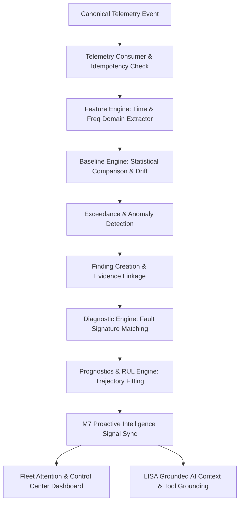

# M17 Intelligence Architecture: Live Telemetry to Grounded Aerospace Intelligence

**Document Version:** 1.0  
**Author:** Tech Guy 2 (Intelligence-Side Engineering, Kota Aerospace)  
**Date:** September 2026  

---

## 1. Architectural Mission & Boundary

The Kota Aerospace Intelligence Layer takes Canonical Telemetry at the ingress boundary and transforms it through a 100% deterministic, evidence-grounded intelligence chain into actionable insights for the Kota Control Center and LISA (AI Assistant).



### Absolute Separation of Concerns
- **Tech Guy 1 (Acquisition Layer):** Physical UAVs, flight controllers, sensors, MAVLink stream decoding, edge networking, and normalization into Canonical Telemetry.
- **Tech Guy 2 (Intelligence Layer):** Canonical Telemetry consumption, feature extraction, baseline evaluation, exceedance detection, finding creation, evidence preservation, fault isolation, RUL prognostics, proactive signals, and grounded AI explanation.

---

## 2. Ingress Boundary: Canonical Telemetry Contract

The boundary contract is strictly defined by `NormalizedTelemetryEvent`:

```python
class NormalizedTelemetryEvent(BaseModel):
    source_system: str          # e.g., "KOTA_GATEWAY", "MAVLINK_CONNECTOR"
    source_event_id: str        # Unique event ID for deterministic deduplication
    source_asset_id: str        # Asset Serial Number or Registration
    event_type: str             # "REALTIME_TELEMETRY", "SENSOR_BURST", "FLIGHT_COMPLETED"
    event_timestamp: datetime   # UTC timestamp of measurement
    flight: TelemetryFlightPayload | None
    battery: TelemetryBatteryPayload | None
    readings: list[TelemetryReadingItem]
    raw_metadata: dict[str, Any]
```

Every measurement reading includes:
- `sensor_code`: Hardware or virtual sensor identifier (e.g. `VIB_01`, `MOT_TEMP_01`)
- `measurement_type`: Measurement domain (`vibration`, `temperature`, `current`, `voltage`, `pressure`)
- `value`: Measured float value
- `unit`: Measurement unit (`mm/s`, `celsius`, `amperes`, `volts`, `bar`)
- `data_quality`: `VALID`, `SUSPECT`, `OUT_OF_RANGE`, `STALE`, `DUPLICATE`, `INVALID`

---

## 3. Real-Time Deterministic Pipeline

### Step 1: Ingestion & Idempotency
- Validates payload against tenant authorization.
- Computes SHA-256 hash and logs entry in `TelemetryEventLog`.
- Resolves asset via `ExternalAssetMapping` or tenant serial index.
- Ignores duplicate `source_event_id` idempotently without re-processing.

### Step 2: Feature Extraction
- Gathers window of latest valid sensor readings (default $N=20$).
- Computes time-domain statistics (`mean`, `median`, `std_dev`, `p95`, `variance`, `range`).
- Computes vibration metrics (`rms`, `peak`, `crest_factor`, `kurtosis`, `skewness`).
- Computes frequency spectrum via Discrete Fourier Transform (`dominant_frequency`, `spectral_energy`, `band_energy`).
- Computes rate-of-change and least-squares trend ($\beta_1$).
- Persists computed metrics in `HUMSFeature`.

### Step 3: Baseline Evaluation
- Compares computed features against versioned, immutable statistical baseline (`HUMSBaseline`).
- Calculates standardized deviation ($Z = \frac{x - \mu}{\sigma}$) and deviation state:
  - `NORMAL`: Within baseline confidence interval ($\le 2\sigma$)
  - `ELEVATED`: $2\sigma < Z \le 3\sigma$
  - `DEVIATED`: $3\sigma < Z \le 4\sigma$
  - `SEVERE`: $> 4\sigma$
- Evaluates trend direction (`STABLE`, `INCREASING`, `DECREASING`, `VOLATILE`, `ACCELERATING`) and consecutive breach count.

### Step 4: Exceedance Detection & Finding Creation
- When an engineering limit or statistical threshold is breached:
  - Records `HUMSExceedance` linked to contributing sensor reading IDs.
  - Automatically raises formal MRO `Finding` linked to `asset_id` and `component_id`.
  - Links tamper-evident `Evidence` record containing full provenance (sensor metadata, reading IDs, feature values, timestamps).

### Step 5: Diagnostics & Fault Isolation
- Matches active feature deviations against versioned `FaultSignature` registry:
  - `VIB-BRG-001` (Bearing Degradation): Elevated RMS + elevated kurtosis.
  - `VIB-IMB-001` (Rotor Imbalance): Elevated RMS + normal kurtosis.
  - `SEN-ANOM-001` (Sensor Anomaly): Single sensor divergence vs peer sensors.
- Upserts `HUMSDiagnosticCandidate` with primary, supporting, and contradicting evidence.

### Step 6: Prognostics & Remaining Useful Life (RUL)
- Fits linear degradation model ($y(t) = \beta_0 + \beta_1 t$) over historical usage span.
- Detects model drift against latest observations.
- Calculates RUL point estimate and $95\%$ prediction interval $[RUL_{\text{lower}}, RUL_{\text{upper}}]$.
- Strictly tags confidence: `AVAILABLE`, `LIMITED`, `INSUFFICIENT_DATA`, `LOW_CONFIDENCE`, `STALE`.
- Enforces non-negotiable disclaimer: **"ESTIMATE — NOT A CERTIFIED LIFE LIMIT"**.

### Step 7: M7 Proactive Intelligence Signals
- Synchronizes persistent early-warning records in `ProactiveSignalRecord`.
- Emits deduplicated signals (`HUMS_VIBRATION_EXCEEDANCE`, `HUMS_DIAGNOSTIC_CANDIDATE`, `HUMS_RUL_WARNING`, `TELEMETRY_FRESHNESS`).
- Includes severity, priority, explanation trace, contributing factors, and direct action items.

### Step 8: LISA Grounded Context & Control Center
- LISA Assistant accesses structured data via authoritative tools:
  - `get_asset_hums_health_intelligence`
  - `get_asset_hums_diagnostics`
  - `get_asset_hums_prognostics`
  - `get_asset_proactive_signals`
  - `get_asset_telemetry_status`
- Guarantees zero hallucinations: if data is absent, LISA explicitly states `UNKNOWN` or `INSUFFICIENT_DATA`.

---

## 4. Multi-Tenancy & Data Isolation

1. Every database query filters by `organization_id`.
2. Telemetry mappings, sensors, readings, features, baselines, findings, diagnostics, prognostics, and signals are strictly scoped to the tenant organization.
3. Cross-tenant queries are blocked at the repository and service layer.

---

## 5. Telemetry Freshness & Degraded Data Quality

1. Freshness policies enforce tenant, asset, or source-specific staleness thresholds.
2. If telemetry stops flowing, the state transitions to `STALE`, raising a `TELEMETRY_FRESHNESS` signal.
3. The system NEVER assumes "no telemetry" means "healthy".
4. Out-of-range, NaN, or corrupted values are tagged `INVALID` or `OUT_OF_RANGE` and excluded from statistical feature calculations without crashing the pipeline.

---
