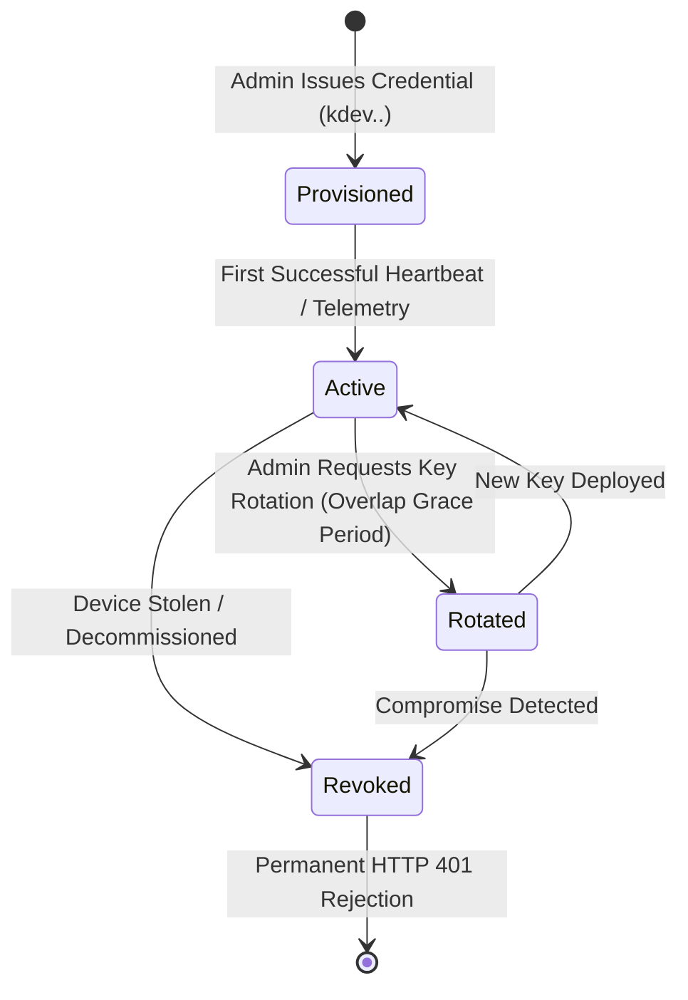

# KOTA AEROSPACE — M19: DEVICE IDENTITY & SECURITY DESIGN

**Milestone:** M19 — Remote Drone Telemetry Gateway, Cloud Connectivity & Field Pilot Integration  
**Date:** 2026-10-03  
**Target Services:** `backend/app/services/device_auth_service.py`, `backend/app/api/v1/device_gateway.py`  

---

## 1. Machine-to-Cloud Authentication Model

Edge gateways and companion computers authenticate to the Kota Aerospace platform using **Cryptographically Secure Device Credentials**:

$$\text{Token Format: } \texttt{kdev.} \langle \text{EdgeDevice UUID} \rangle \texttt{.} \langle 256\text{-bit CSPRNG Secret} \rangle$$

### Key Security Properties:
1. **Opaque Machine Token:** Presented in the standard `X-Kota-Device-Key` HTTP header.
2. **Server-Side SHA-256 Hashing:** The plaintext secret is never stored in PostgreSQL. Only `SHA-256(secret)` is stored in `EdgeDevice.metadata_json["credential"]["hash"]`.
3. **Zero Tenant Spoofing:** The `organization_id`, bound `asset_id` (drone), and `data_source_id` are strictly resolved from the authenticated database row. An edge device cannot submit data to a different tenant or aircraft by tampering with request payloads.
4. **Constant-Time Comparison:** Cryptographic token verification uses `hmac.compare_digest` to prevent side-channel timing attacks.
5. **Uniform Error Responses:** Any authentication failure (unknown device UUID, revoked status, expired token, or invalid secret) yields a uniform **HTTP 401 Unauthorized** without revealing internal device state.

---

## 2. Device Credential Lifecycle

### 2.1 Credential Provisioning
- Tenant administrators provision devices via the Organisation Portal (`/api/v1/edge/devices`).
- The plaintext token is generated using `secrets.token_urlsafe(32)` and returned **exactly once** in the provisioning response.

### 2.2 Seamless Key Rotation with Grace Period
- When rotating keys, the previous hash remains valid for a configurable grace period (`previous_valid_until`, default 3600 seconds), enabling zero-downtime fleet credential rollouts.

### 2.3 Instant Revocation
- Setting `EdgeDevice.status = REVOKED` instantly blocks all subsequent telemetry and heartbeats from that gateway.

---

## 3. Threat Model & Mitigations

| Threat Vector | Potential Impact | Architecture Mitigation |
| :--- | :--- | :--- |
| **Credential Interception (MITM)** | Attacker steals device token and injects fabricated telemetry. | Mandatory TLS 1.3 / HTTPS encryption; certificate validation on edge gateway. |
| **Tenant Boundary Escape** | Attacker modifies tenant ID in payload to pollute competitor data. | Tenant context is extracted server-side strictly from the database row bound to the device UUID. |
| **Replay Attack on Buffered Queue** | Malicious replay of old telemetry frames. | Database sequence checking, timestamp freshness gates, and MAVLink packet sequence deduplication. |
| **Denial of Service via Giant Payloads** | Attacker exhausts cloud server memory. | Strict request body bounding: `MAX_DEVICE_UPLOAD_BYTES = 1 * 1024 * 1024` (1MB max per batch). |
| **Edge Storage Exhaustion** | Extended network blackout fills edge device disk. | Bounded local SQLite queue with FIFO eviction of oldest non-critical frames when limit reached. |
