# KOTA AEROSPACE — M19: EXISTING TELEMETRY CAPABILITY AUDIT

**Milestone:** M19 — Remote Drone Telemetry Gateway, Cloud Connectivity & Field Pilot Integration  
**Date:** 2026-10-03  
**Target Repository:** `C:\Users\ramna\Documents\Aerocomply`  

---

## 1. Executive Summary & Audit Purpose

Before implementing the field gateway for M19, this audit inspects the existing codebase to map out:
1. What telemetry transports and ingestion pipelines are already implemented.
2. How machine/device identity and authentication currently work.
3. How live fleet state, PostgreSQL persistence, HUMS, and LISA consume telemetry.
4. The exact gaps that require development for field pilot readiness.

---

## 2. Capability Implementation Map

| Capability / Component | Source File / Module | Implementation Status | Reusability in M19 |
| :--- | :--- | :--- | :--- |
| **Device Authentication & Key Management** | `backend/app/services/device_auth_service.py` | **100% Implemented** | Full reuse (`kdev.<uuid>.<secret>` token in `X-Kota-Device-Key`). SHA-256 hash storage, constant-time validation. |
| **Machine-to-Cloud Device Gateway API** | `backend/app/api/v1/device_gateway.py` | **100% Implemented** | Full reuse (`POST /api/v1/device/telemetry/mavlink`, `POST /api/v1/device/heartbeat`). Enforces tenant scoping and telemetry entitlements. |
| **MAVLink Frame Ingestion & Validation** | `backend/app/services/edge/mavlink_connector.py` | **100% Implemented** | Full reuse. Supports MAVLink v1/v2 binary frames, packet CRC, timestamp normalization, and signing. |
| **Acquisition Orchestration** | `backend/app/services/acquisition_service.py` | **100% Implemented** | Full reuse. Unifies MAVLink/MQTT data sources, produces `NormalizedTelemetryEvent`, and drives persistence. |
| **Authoritative Telemetry Persistence** | `backend/app/services/telemetry_service.py` | **100% Implemented** | Full reuse. Persists to `telemetry_samples`, updates asset flight hours, and evaluates exceedances. |
| **Live Fleet State & SSE Stream** | `backend/app/services/live_state_service.py`, `app/api/v1/live.py` | **100% Implemented** | Full reuse. `LiveBroker` distributes real-time state updates to `/live/stream` and `/live/fleet`. |
| **HUMS & Vibration Diagnostics** | `backend/app/services/hums_service.py` | **100% Implemented** | Full reuse. Real-time extraction of vibration RMS, thermal baselines, and `ProactiveSignalRecord` creation. |
| **LISA Grounded Operational Assistant** | `backend/app/services/lisa/orchestration_service.py` | **100% Implemented** | Full reuse. Grounded queries for fleet telemetry freshness, alerts, and vehicle status. |
| **Edge Gateway Client (GCS / Companion)** | *Standalone edge client package* | **Gaps Identified** | **To be built in M19:** Standalone lightweight Python edge gateway with local store-and-forward queue (SQLite), MAVLink listener, and HTTPS uploader. |

---

## 3. Verified Ingestion Transports & Endpoints

1. **Machine-to-Cloud Binary MAVLink Endpoint:**
   - **Route:** `POST /api/v1/device/telemetry/mavlink`
   - **Auth Header:** `X-Kota-Device-Key: kdev.<uuid>.<secret>`
   - **Payload:** Raw MAVLink binary frames (up to 1MB per batch).
   - **Tenant Protection:** Ingested frames are strictly bound to the authenticated `EdgeDevice` row (`organization_id`, `asset_id`, `data_source_id`).
2. **Machine-to-Cloud Heartbeat Endpoint:**
   - **Route:** `POST /api/v1/device/heartbeat`
   - **Auth Header:** `X-Kota-Device-Key: kdev.<uuid>.<secret>`
   - **Payload:** Device status, queue metrics, CPU/memory stats, firmware version.
3. **JWT-Authenticated Telemetry Batch Ingestion:**
   - **Route:** `POST /api/v1/telemetry/ingest`
   - **Payload:** Normalized JSON telemetry points (`TelemetryIngestRequest`).
4. **Live Fleet Event Stream:**
   - **Route:** `GET /api/v1/live/stream`
   - **Transport:** Server-Sent Events (SSE) with monotonic sequence cursors.

---

## 4. Architectural Gap Analysis for M19

While the **cloud-side ingestion, persistence, and intelligence layers are complete and tested**, physical field operations require a self-contained, robust **Edge Telemetry Gateway**:

```mermaid
flowchart LR
    subgraph DroneLine ["Flight Hardware / GCS"]
        Autopilot["PX4 / ArduPilot / MAVLink"]
    end

    subgraph EdgeGateway ["Kota Remote Edge Gateway (To Implement)"]
        Listener["MAVLink Receiver (UDP/Serial/TCP)"]
        Buffer["Persistent Local SQLite Queue"]
        Uploader["HTTPS Batch Client with Exponential Backoff"]
    end

    subgraph CloudPlatform ["Kota Aerospace Cloud"]
        IngestAPI["/api/v1/device/telemetry/mavlink"]
        DB[("PostgreSQL")]
        LiveMap["Live Fleet Map"]
    end

    Autopilot -->|MAVLink| Listener
    Listener --> Buffer
    Buffer --> Uploader
    Uploader -->|HTTPS + X-Kota-Device-Key| IngestAPI
    IngestAPI --> DB --> LiveMap
```

### Key Requirements for the Edge Gateway Client:
1. **Zero Cloud Redesign Needed:** The cloud backend (`device_gateway.py`, `device_auth_service.py`, `acquisition_service.py`) already provides the complete endpoint surface.
2. **Store-and-Forward Reliability:** Persistent SQLite queue ensures zero telemetry loss during 4G/LTE cellular dropouts in rural flight zones.
3. **Pluggable Inputs:** Support UDP (`udp:127.0.0.1:14550`), Serial COM ports (`COM3`, `/dev/ttyUSB0`), and TCP streams from MAVProxy, QGroundControl, and Mission Planner.
4. **Secure Machine Identity:** Simple configuration via `.env` or YAML containing `KOTA_API_URL` and `KOTA_DEVICE_KEY`.

---

## 5. Minimal-Change Implementation Recommendation

- **Backend / Cloud:** **0 breaking changes required**. The existing `/api/v1/device/telemetry/mavlink` and `/api/v1/device/heartbeat` are fully functional.
- **Edge Gateway:** Implement a clean, modular Python package `gateway/` (e.g. `gateway/kota_gateway.py`) with `pymavlink` support, local SQLite buffering, bounded backoff retry, and structured logging.
- **Testing:** Build an automated end-to-end integration test harness simulating packet drops, network disconnection, queue replay, and live map delivery.
