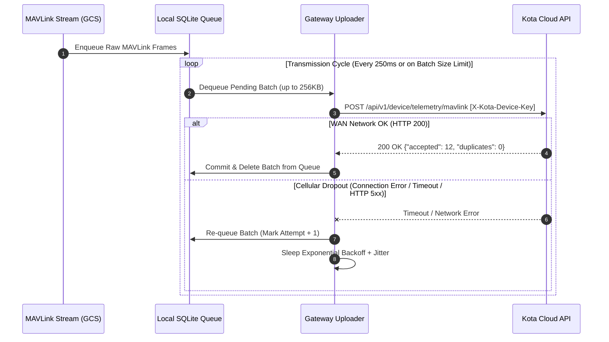

# KOTA AEROSPACE — M19: REMOTE GATEWAY ARCHITECTURE

**Milestone:** M19 — Remote Drone Telemetry Gateway, Cloud Connectivity & Field Pilot Integration  
**Date:** 2026-10-03  
**Target Component:** Kota Remote Edge Telemetry Gateway (`gateway/`)  

---

## 1. System Overview & Objectives

The **Kota Remote Edge Gateway** is a lightweight, standalone daemon designed to run on physical ground control station (GCS) computers (Windows/macOS/Linux) or onboard companion computers (Raspberry Pi 4/5, NVIDIA Jetson Orin).

It decouples the flight line from the development environment by continuously:
1. Receiving MAVLink telemetry packets over UDP, Serial COM, or TCP.
2. Buffering raw packets locally in a high-performance, embedded SQLite queue (store-and-forward).
3. Securely uploading batches of MAVLink frames over HTTPS with `X-Kota-Device-Key` machine credentials.
4. Automatically retrying with exponential backoff and jitter during cellular/WAN link dropouts.
5. Transmitting periodic system and queue health telemetry heartbeats.

```mermaid
flowchart TD
    subgraph FlightLine ["Physical Drone / GCS"]
        Autopilot["Autopilot (PX4 / ArduPilot)"]
        GCSApp["GCS / Companion Computer (MAVProxy, QGC, MissionPlanner)"]
    end

    subgraph EdgeGatewayDaemon ["Kota Edge Gateway Daemon"]
        MAVReceiver["MAVLink Receiver (UDP / Serial / TCP)"]
        LocalQueue[("Persistent SQLite Queue (FIFO Store-and-Forward)")]
        RetryMgr["Retry Manager (Exponential Backoff + Jitter)"]
        Uploader["HTTPS Outbound Client (TLS + X-Kota-Device-Key)"]
        HealthMonitor["Gateway Health Monitor (CPU, RAM, Queue Depth)"]
    end

    subgraph KotaCloud ["Kota Aerospace Cloud Platform"]
        IngestEndpoint["POST /api/v1/device/telemetry/mavlink"]
        HeartbeatEndpoint["POST /api/v1/device/heartbeat"]
        DB[("PostgreSQL: telemetry_samples & live_state")]
        LiveMapUI["Organisation Live Fleet Map"]
        HUMS["HUMS & Health Scoring"]
    end

    Autopilot -->|MAVLink v1/v2| GCSApp
    GCSApp -->|UDP:14550 / Serial COM| MAVReceiver
    MAVReceiver -->|Enqueue Binary Frames| LocalQueue
    LocalQueue -->|Dequeue Batch (up to 256KB)| RetryMgr
    RetryMgr -->|HTTPS Batch Upload| Uploader
    HealthMonitor -->|Periodic Heartbeat| Uploader
    Uploader --> IngestEndpoint & HeartbeatEndpoint
    IngestEndpoint --> DB --> LiveMapUI & HUMS
```

---

## 2. Gateway Module Decomposition

| Module | Python File | Core Responsibilities |
| :--- | :--- | :--- |
| **Configuration Manager** | `gateway/config.py` | Loads and validates gateway environment variables (`KOTA_API_URL`, `KOTA_DEVICE_KEY`, `MAVLINK_SOURCE`, `BATCH_SIZE_BYTES`, `QUEUE_MAX_ENTRIES`). |
| **MAVLink Receiver** | `gateway/mavlink_receiver.py` | Asynchronously listens on UDP (`0.0.0.0:14550`), Serial (`COMx` or `/dev/ttyUSB0`), or TCP, segmenting and parsing binary MAVLink frames. |
| **Local Store-and-Forward Queue** | `gateway/local_queue.py` | Persistent embedded SQLite queue with write-ahead logging (WAL), crash resilience, maximum capacity enforcement, and FIFO replay. |
| **Outbound HTTPS Uploader** | `gateway/uploader.py` | Formats requests, injects `X-Kota-Device-Key` header, manages HTTP keep-alive connection pooling, and handles batch delivery. |
| **Retry & Backoff Manager** | `gateway/retry_manager.py` | Implements truncated exponential backoff ($T = \min(T_{\max}, T_{\text{base}} \times 2^{\text{attempt}}) \pm \text{jitter}$) to prevent thundering herd upon network reconnect. |
| **Gateway Health Monitor** | `gateway/health.py` | Collects gateway CPU load, memory utilization, disk queue byte size, packet drop counters, and issues heartbeat payloads. |
| **CLI & Process Supervisor** | `gateway/kota_gateway.py` | Main entry point with CLI flags, structured logging, graceful signal handling (`SIGINT`, `SIGTERM`), and background worker coordination. |

---

## 3. Store-and-Forward Ingestion Protocol



---

## 4. Bounded Queue & Disk Safety Policy

To protect field companion computers (e.g. Raspberry Pi SD cards) from disk exhaustion during prolonged cellular blackouts:
1. **Max Capacity Limit:** Queue is bounded by default to 50,000 packets or 100MB (`QUEUE_MAX_BYTES = 104857600`).
2. **Eviction Policy:** When queue reaches 100% capacity, the oldest unacknowledged non-critical packets are evicted with explicit warnings logged, ensuring new telemetry can always be recorded.
3. **Database Maintenance:** SQLite runs in `WAL` mode with automatic vacuuming on startup.
