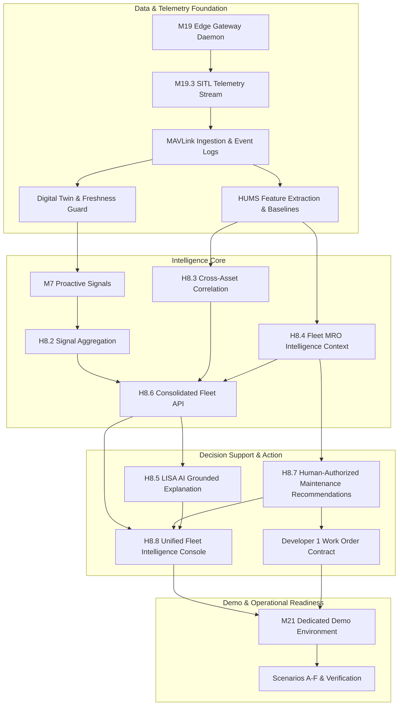

# M21 — MASTER BASELINE AND DEPENDENCY REPORT
## Unified Intelligence, Demo Environment & Operational Readiness

**Workstream:** Antigravity — Master Technical Lead and Implementation Agent  
**Milestone:** M21  
**Baseline Commit:** `1cf3756` (H8.6)  
**Branch:** `staging/m17-drone-ops-review`  
**Date:** 2026-10-04  
**Status:** AUDITED & BASELINE SECURED  

---

## 1. Executive Summary & Repository Status

A full audit of the Kota Aerospace / AeroComply repository was completed across all workstreams (Developer 1, Developer 2.1, Developer 2.2, and DevOps).

### 1.1 Git Working-Tree & Upstream State
- **Current Branch:** `staging/m17-drone-ops-review`
- **HEAD Commit:** `1cf3756` (`feat(api): expose consolidated public fleet intelligence endpoints (H8.6)`)
- **Ahead of Remote:** Ahead of `origin/staging/m17-drone-ops-review` by 10 commits (local branch accumulates verified milestones H8.3, H8.5, and H8.6).
- **Working Tree Cleanliness:** All H8.6 code is cleanly committed. No untracked scratch files exist from H8.6.

### 1.2 Verification of Predecessor Commits
- **H8.3:** Commit `8138c95` (`feat(intelligence): implement H8.3 cross-asset HUMS correlation engine and fleet anomaly intelligence`). Verified 34/34 integration tests pass.
- **H8.5:** Commit `6d5752d` (`feat(lisa): ground LISA AI fleet intelligence in H8.3 cross-asset correlations and M7 canonical signals`). Verified 17/17 integration tests pass.
- **H8.6:** Commit `1cf3756` (`feat(api): expose consolidated public fleet intelligence endpoints`). Verified 17/17 integration tests pass.
- **M19 Edge Gateway:** Commit `6c53358` (`feat(m19): package edge gateway, add systemd service, CLI entrypoint and secure device provisioning tooling`).
- **M19.3 Automated SITL Harness:** Implemented in `backend/scripts/run_gateway_sitl_stream.py` and `backend/tests/integration/test_m19_sitl_harness.py`. Verified 4/4 integration tests pass.

---

## 2. Parallel Workstream Inventory & Untracked File Ownership

To ensure that parallel developer work is rigorously preserved and not overwritten:

| Workstream / Owner | Files / Artifacts | Status | Action in M21 |
| :--- | :--- | :--- | :--- |
| **DevOps / Infra** | `DEPLOYMENT_CHANGELOG.md` `RELEASE_READINESS.md` `KOTA_DRONE_SUITE_STAGING_DEPLOYMENT_REPORT.md` | Completed & Documented | Preserve unmodified; reference deployment URLs for Phase 7 verification. |
| **Developer 1 (Operations & M17)** | `M17_DRONE_OPERATIONS_VALIDATION.md` `M18_DRONE_SUITE_OPERATIONAL_READINESS_REPORT.md` `M18_INTEGRATION_GAP_REGISTER.md` `M18_SECURITY_AND_TENANCY_AUDIT.md` `M18_TELEMETRY_END_TO_END_VALIDATION.md` `M18_TEST_AND_VERIFICATION_REPORT.md` | Implemented & Documented | Preserve unmodified; reuse Developer 1's `WorkOrder` and `Finding` contracts for Phase 2 (H8.7). |
| **Developer 2.2 (Gateway & SITL)** | `backend/scripts/run_gateway_sitl_stream.py` `backend/tests/integration/test_m19_sitl_harness.py` `M19_2_VERIFICATION_AND_INTEGRATION_REPORT.md` `M19_3_SITL_INTEGRATION_REPORT.md` | Implemented & Verified | Formally verify and integrate in Phase 5; do not overwrite. |
| **Hardware Lead (M20)** | `M20_HARDWARE_VALIDATION_PLAN.md` | Defined & Gated | Preserve unmodified; recognize M20 hardware dependencies (CM4/LTE/Serial) as physically blocked until bench setup is available. |
| **Governance / PM** | `ENGINEERING_WORKSTREAM_OWNERSHIP.md` `MASTER_PROJECT_STATUS.md` `PRODUCT_GAP_AND_ROADMAP.md` `ORGANISATION_PORTAL_PRODUCTION_QA.md` `PLATFORM_RELIABILITY_AND_SECURITY_AUDIT.md` | Current Baseline Docs | Preserve unmodified; align M21 acceptance criteria strictly to these requirements. |

---

## 3. Capability Status Classification Matrix

| Capability / Subsystem | Categorization | Evidence / Location | Notes |
| :--- | :--- | :--- | :--- |
| **H8.0 Fleet Foundation** | **Implemented & Verified** | `backend/tests/integration/test_h8_0_fleet_foundation.py` | 17/17 passed. |
| **H8.2 M7 Signal Integration** | **Implemented & Verified** | `backend/tests/integration/test_h8_2_m7_signal_integration.py` | 15/15 passed. |
| **H8.3 Cross-Asset Correlation** | **Implemented & Verified** | `backend/tests/integration/test_h8_3_fleet_hums_correlation.py` | 34/34 passed. |
| **H8.4 Fleet MRO Context** | **Implemented & Verified** | `backend/tests/integration/test_h8_4_fleet_mro_intelligence.py` | 26/26 passed. |
| **H8.5 LISA Fleet Grounding** | **Implemented & Verified** | `backend/tests/integration/test_h8_5_lisa_fleet_grounding.py` | 17/17 passed. |
| **H8.6 Consolidated Fleet API** | **Implemented & Verified** | `backend/tests/integration/test_h8_6_fleet_intelligence_api.py` | 17/17 passed. |
| **H8.7 Predictive Maintenance Recommendations** | **Partially Implemented** | `backend/app/models/mro_intelligence.py` `backend/app/services/mro_intelligence_service.py` | Review/accept/reject lifecycle exists; drafting work-order workflow requires completion in Phase 2. |
| **H8.8 Unified Fleet Console** | **Partially Implemented** | `frontend/app/(app)/intelligence/fleet/page.tsx` | Page exists; needs consolidation to consume H8.6 `/overview`, `/signals`, `/mro` and H8.7 recommendation review actions. |
| **M19.3 Automated SITL Harness** | **Implemented & Verified** | `backend/tests/integration/test_m19_sitl_harness.py` | 4/4 passed in standalone execution. |
| **M20 Physical Hardware Validation** | **Blocked by External Dependencies** | Bench hardware (CM4, Quectel LTE, UART) unavailable in current environment | Gated on physical hardware bench commissioning. |
| **M21 Dedicated Demo Environment** | **Not Implemented** | Requires idempotent seed script & realistic multi-scenario data | Mandatory M21 deliverable. |

---

## 4. Internal Dependency Graph

---

## 5. Architectural Non-Negotiables for M21

1. **Strict Read-Only Enforcement for AI:** LISA remains an advisory explanation and decision-support layer. Under no circumstances can LISA autonomously create or execute work orders.
2. **Human Authorization Gate:** All predictive maintenance recommendations must follow an explicit human review and authorization lifecycle (`OPEN` -> `UNDER_REVIEW` -> `ACCEPTED` -> `DRAFTED_AS_WORK_ORDER`).
3. **No Demo Pollution in Customer Tenants:** Demo data must be isolated strictly to `Kota Aerospace Demo Operations` (slug: `kota-demo-ops`) and must be cleanly resettable.
4. **Authentic Data Freshness:** Missing telemetry must never default to healthy. Stale data flags and simulation flags (`is_simulation=True`) must remain strictly transparent in both API and UI.

The repository baseline is fully secured, dependencies are cleanly mapped, and execution can safely proceed to Phase 1 and Phase 2.
