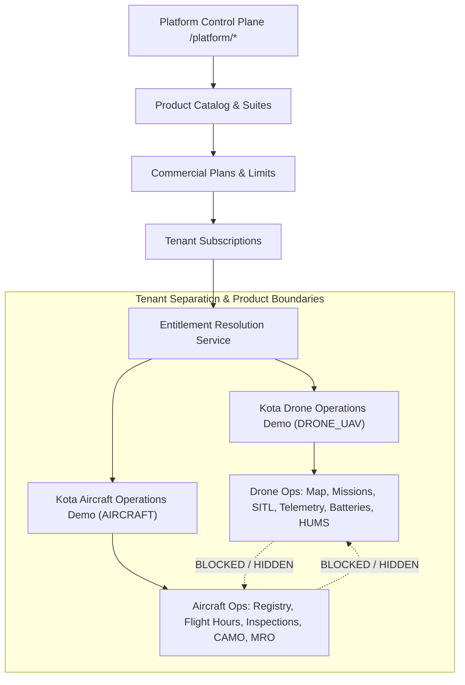

# KOTA AEROSPACE — M22 ARCHITECTURE GAP REPORT
**Milestone:** M22 — Unified Product Readiness & End-to-End System Integrity  
**Date:** October 2026  
**Auditor:** Principal Software Architect & Product Readiness Lead  
**Scope:** Multi-Tenant Isolation, Product Suite Partitioning, Entitlement Resolution, Navigation & Gating

---

## 1. Architectural Model Evaluation

Kota Aerospace implements an aerospace-grade multi-tenant platform with common infrastructure (Auth, Organizations, Audit, Compliance, Work Orders, AI Orchestration) supporting four distinct asset verticals:
1. **Drone / UAV Operations (`DRONE_UAV`)** — Primary commercial focus
2. **Commercial Aircraft (`AIRCRAFT`)** — Independent fixed-wing CAMO & MRO
3. **Rotorcraft (`HELICOPTER`)** — Rotor track & balance HUMS
4. **Advanced Air Mobility (`EVTOL_AAM`)** — Distributed electric propulsion & battery health



---

## 2. Identified Architectural Gaps & Remediations

### Gap 1: Frontend Sidebar Suite Exclusion Defect
- **Condition:** In `frontend/components/layout/Sidebar.tsx`, the navigation filtering only checks RBAC permissions:
  ```typescript
  const permitted = (href: string) => isPlatformUser || !isRouteForbidden(href, user?.permissions);
  const visibleGroups = groups
    .map((g) => ({ ...g, items: g.items.filter((i) => permitted(i.href)) }))
    .filter((g) => g.items.length > 0);
  ```
  Items that are unavailable due to lack of product suite entitlement (e.g. `/aircraft` for a Drone-only tenant, or `/drone-ops/overview` and `/drones` for an Aircraft-only tenant) are retained in `visibleGroups` and rendered with `opacity: 0.5` and a lock icon `🔒`.
- **Architectural Violation:** Violates Section 4.1 & 4.2 visibility rules:
  - *"The drone demonstration tenant must not see aircraft-only product modules or aircraft-only navigation options."*
  - *"The aircraft demonstration tenant must not see Drone Operations navigation, Drone mission interfaces, Drone-specific fleet controls."*
- **Remediation:** Define vertical suite requirements for domain-specific routes in `navFeatureMap.ts`. In `Sidebar.tsx`, filter out vertical items when the tenant does not hold the requisite suite/vertical feature. Intra-tier feature gating (features within the held vertical) may remain styled as disabled/locked, but foreign vertical modules must be completely omitted from navigation.

### Gap 2: Unmapped Aircraft Component Routes in `NAV_FEATURE_MAP`
- **Condition:** In `frontend/lib/entitlements/navFeatureMap.ts`, `/engines` is not mapped to `FEATURE_KEYS.AIRCRAFT_FLEET_MANAGEMENT`. Consequently, `isNavItemUnavailable("/engines", hasFeature)` returns `false`, erroneously presenting jet engine management to Drone operators.
- **Architectural Violation:** Cross-vertical bleed of commercial components.
- **Remediation:** Map `/engines` to `FEATURE_KEYS.AIRCRAFT_FLEET_MANAGEMENT` in `NAV_FEATURE_MAP` and ensure `isFeatureAllowedForSuite` disallows it for `DRONE_UAV`.

### Gap 3: Single Mixed-Fleet Demo Tenant vs Two Dedicated Product Demonstrations
- **Condition:** Prior milestone (M21) seeded a single combined organization `Kota Aerospace Demo Operations` holding a mixed fleet (5 drones, 2 aircraft, 1 helicopter, 1 eVTOL).
- **Architectural Violation:** Prevents demonstration of pure, vertical-specific customer experiences where a drone operator sees an unpolluted drone workflow and an airline/charter operator sees an unpolluted aircraft workflow.
- **Remediation:** Split demo provisioning into two dedicated, deterministic demonstration tenants:
  1. **`Kota Drone Operations Demo`**
     - Industry: `DRONE_UAV`
     - Suite: `DRONE_UAV`
     - Plan: `DRONE_ENTERPRISE`
     - Fleet: 5 drones (`KOTA-UAV-01` to `05`), batteries, simulated SITL telemetry, HUMS baselines/exceedances, M7 proactive signals, MRO candidates.
     - Role access: Org Admin, Fleet Operator, Pilot.
  2. **`Kota Aircraft Operations Demo`**
     - Industry: `AIRCRAFT`
     - Suite: `AIRCRAFT`
     - Plan: `AIRCRAFT_COMMERCIAL`
     - Fleet: 2 fixed-wing transport category aircraft (`N701KA`, `N702KA`), flight hours/cycles, CAMO work orders, discrepancies/MEL, airworthiness directives.
     - Role access: Org Admin, Maintenance Director, Inspector.

### Gap 4: Direct URL Route Protection Defense-in-Depth
- **Condition:** While list routes have `<SuiteGuard requiredSuite="...">`, individual detail pages (such as `/aircraft/[id]`) rely on dynamic prefix matching in `RouteEntitlementGuard`.
- **Architectural Verification:** `RouteEntitlementGuard.tsx` correctly resolves longest prefix for `/aircraft/*` to `aircraft_fleet_management`, and `FeatureGuard` blocks unauthorized access with a clear "Suite Restriction" message. Backend routes enforce `require_feature(...)` returning 403 Forbidden.
- **Remediation:** Add layout-level `SuiteGuard` for `/aircraft` (similar to `/drone-ops/layout.tsx`) so that all subroutes under `/aircraft/*` are uniformly guarded at the React component boundary before mounting.

### Gap 5: Lisa AI Copilot Context Partitioning
- **Condition:** LISA tools (`backend/app/services/ai/tools.py`) execute within the caller's `organization_id` and check `require_feature` (e.g. `drone_fleet_management` for drone tools, `aircraft_fleet_management` for aircraft tools).
- **Verification:** Verified by `test_lisa_security_entitlements.py`. LISA cannot be prompted by a Drone tenant to read or mutate aircraft records, nor by an Aircraft tenant to query drone missions.
- **Remediation:** Maintain existing tool-level entitlement checks (`check_tool_entitlement`).

---

## 3. Implementation Roadmap for M22 Architecture Fixes

| Task ID | Component | File Targets | Action |
|---|---|---|---|
| **ARCH-01** | Frontend Nav | `frontend/components/layout/Sidebar.tsx` | Filter out unheld vertical suite items from `visibleGroups`. |
| **ARCH-02** | Feature Map | `frontend/lib/entitlements/navFeatureMap.ts` | Map `/engines` to `aircraft_fleet_management`. |
| **ARCH-03** | Layout Guard | `frontend/app/(app)/aircraft/layout.tsx` | Add `<SuiteGuard requiredSuite="AIRCRAFT">` wrapping all aircraft routes. |
| **ARCH-04** | Demo Seeder | `backend/scripts/seed_m22_demo_tenants.py` | Create idempotent seeder for `Kota Drone Operations Demo` and `Kota Aircraft Operations Demo`. |
| **ARCH-05** | Demo Platform UI | `frontend/lib/demo/demoPlatform.ts` | Update synthetic demo data to define both demo organizations and their isolated profiles. |
