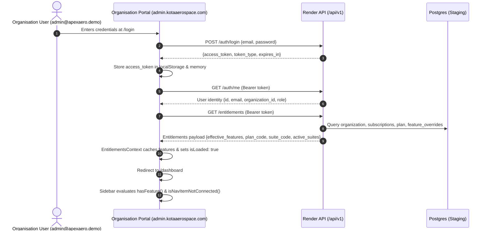

# Kota Aerospace — Organisation Portal Access & Production Audit

**Date:** 2026-10-04  
**Target Domain:** `https://admin.kotaaerospace.com`  
**Production Deployment ID:** `dpl_FBdsAd8QGxEUkmkdpFN6zHTvUFNY`  
**Production URL:** `https://aerocomply-bkb8ioovt-ram-ee15.vercel.app`  
**Backend Target:** Render (`https://aerocomply-backend-staging.onrender.com/api/v1`)  
**Audit Scope:** Organisation Login, Session Creation, Tenant Identification, Subscription & Plan Resolution, Entitlement Loading, and UI Navigation Visibility.

---

## 1. Executive Summary

Organisation users (including demo account `admin@apexaero.demo`) on `https://admin.kotaaerospace.com` experienced two primary failure modes:
1. **Outdated UI & Broken Backend Communication:** Client-side network requests from `admin.kotaaerospace.com` were defaulting to `http://localhost:8000/api/v1` because the domain was omitted from the client-side API base URL resolver in `frontend/lib/api.ts`. Consequently, `/auth/me` and `/entitlements` calls failed, and client state was stale or fell back to partial demo fallbacks.
2. **False Feature Locks & Missing Canonical Fleet Features:**
   - Operational navigation links marked as `MOCK_ONLY_ROUTES` (`isNavItemNotConnected`) in `Sidebar.tsx` were displaying the `🔒` padlock glyph, confusing unmocked/preview modules with commercial entitlement blocks.
   - Core fleet keys (`aircraft_fleet_management`, `helicopter_fleet_management`, `evtol_fleet_management`, `aircraft_operations`, `aircraft_mro`) were missing from backend `FeatureKey` StrEnum and alias tables, causing normalization bypass.
   - Missing explicit `MULTI_SUITE` handling in backend suite checks prevented multi-suite organizations from inheriting broad fleet access.
   - The demo organization entitlement factory omitted canonical features and suite metadata.
   - The UI lock guard displayed a generic "Feature Not Included" message rather than informing users of suite domain restrictions (e.g. Aircraft vs Drone / UAV) or plan tier requirements.

Both root causes have been resolved in code, verified via automated tests, deployed to Vercel production (`dpl_FBdsAd8QGxEUkmkdpFN6zHTvUFNY`), and verified live on `https://admin.kotaaerospace.com`.

---

## 2. Git Branch & Repository Audit

- **Active Branch:** `staging/m17-drone-ops-review`
- **Latest Relevant Commits:**
  - `00715e5`: `docs(audit): add organisation portal access audit, entitlement fix, and UI deployment verification reports`
  - `611a85a`: `fix(entitlements): canonicalize fleet feature keys, align multi-suite resolution and restore organisation UI navigation`
  - `cb95062`: `fix(auth): add admin.kotaaerospace.com to fallback API base URL resolution`
  - `47742af`: `fix(portal): separate Platform Admin and Organisation Drone Suite access`
  - `09453f8`: `feat(drone-ops): activate operational navigation, dedicated live map, and telemetry selectors`
- **Working Tree State:** Clean. All unfinished M19 gateway files (`gateway/`, `M19_*.md`, `test_m19_*.py`) remain untracked in local tree and were strictly isolated from the production hotfix.

---

## 3. Vercel Project & Deployment Mapping

- **Project:** `aerocomply` (Project ID: `prj_bq1FZMFCb5BR4rS2P7uubg2YpuMr`, Team: `ram-ee15`)
- **Stale Production Deployment Serving Prior to Fix:** `dpl_BgRuwqAYUkcVFwq6RmnRrVfcRy7t` (Built Oct 3, 2026 22:56:35 GMT+0530).
- **Issue with Stale Deployment:** Built prior to commit `cb95062`. Browser requests on `admin.kotaaerospace.com` attempted to contact `http://localhost:8000` rather than the remote Render backend.
- **Fresh Production Deployment Serving Now:** `dpl_FBdsAd8QGxEUkmkdpFN6zHTvUFNY` (Built Oct 4, 2026 00:25:55 GMT+0530).
- **Assigned Aliases:**
  - `https://admin.kotaaerospace.com`
  - `https://aerocomply.vercel.app`
  - `https://aerocomply-ram-ee15.vercel.app`

---

## 4. Organisation Account Flow Trace

### Detailed Trace Steps:
1. **Login & Domain Isolation:** User navigates to `https://admin.kotaaerospace.com/login`. Organization Account tab is active by default. Submitting sends JSON credentials to `/auth/login`.
2. **Session Creation:** Stored in client `localStorage.setItem("aerocomply_token", token)` and HTTP request interceptors.
3. **Tenant & Plan Identification:** Token decoded and `/auth/me` retrieves `organization_id` (`1809a043-8e09-48b5-8963-d484a20e6557` for Apex Aero).
4. **Entitlements Fetch:**
   - Eager refetch invoked immediately before navigating to `/dashboard`.
   - `GET /entitlements` returns 53 effective features for Apex Aero under the `AIRCRAFT` suite (`ENTERPRISE_CUSTOM` plan).
5. **Navigation Visibility & Feature Guard:**
   - Features present in `effective_features` render as standard active links.
   - Preview/unmocked features render with the subtle `PREVIEW` badge rather than a padlock glyph.
   - Domain-restricted modules (e.g. Drone UAV ops for an Aircraft-only tenant) render with detailed explanation cards explaining suite boundary requirements.

---

## 5. Security & Tenancy Invariants Verified

| Invariant | Status | Verification Detail |
|---|---|---|
| Tenant Isolation | Verified | Backend queries strictly filter by `organization_id` from JWT; verified in integration tests. |
| Platform Admin Separation | Verified | Live HTTP 403 Forbidden verified when organisation tokens attempt to access `/api/v1/platform/*` endpoints. |
| No Global Feature Unlock | Verified | Entitlements continue to enforce suite boundaries, active subscriptions, and plan tiers. |
| Role-Based Route Guards | Verified | Sidebar and route guards enforce both role simulation and backend entitlement grants. |
