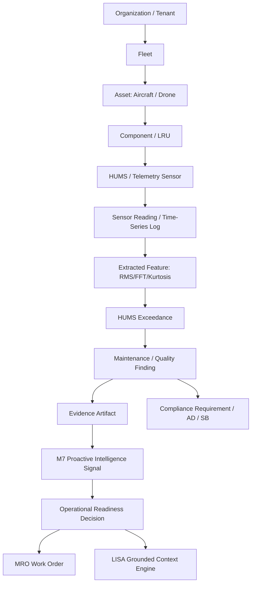

# KOTA Aerospace — Aerospace Intelligence Graph Architecture

## 1. Executive Summary & Principles

The **KOTA Aerospace Intelligence Graph** represents the semantic knowledge and telemetry-to-decision lineage across all operational entities.

### Core Architectural Invariants
1. **PostgreSQL is the Single Authoritative Source of Truth**: All transactional states, compliance determinations, airworthiness certifications, and maintenance records are mastered exclusively in PostgreSQL.
2. **Derived & Indexed Graph Representation**: Any graph store (e.g., Neo4j or in-memory semantic projections) serves solely as a derived read-model for fast multi-hop traversal, topological impact analysis, and cross-asset clustering.
3. **Evidence-Grounded Lineage**: Every edge and node representing an intelligence assertion MUST link back to immutable transactional evidence (`file_hash`, `telemetry_log_id`, or `audit_trail_id`).

---

## 2. Graph Semantic Topology & Schema



### Key Entity Nodes & Relational Edges

| Source Node | Edge (`REL_TYPE`) | Target Node | Attributes & Semantics |
| :--- | :--- | :--- | :--- |
| `Organization` | `OWNS_OPERATES` | `Asset` | Multi-tenant isolation boundary |
| `Asset` | `CONTAINS_SUBASSEMBLY` | `Component` | Hierarchical breakdown (Engines, Avionics, Rotors) |
| `Component` | `MONITORED_BY` | `HUMSSensor` | Sensor location, channel, and sampling parameters |
| `HUMSSensor` | `PRODUCES_STREAM` | `SensorReading` | Validated, quality-flagged readings |
| `SensorReading` | `YIELDS_FEATURE` | `HUMSFeature` | Derived mathematical features (RMS, Peak, Kurtosis) |
| `HUMSFeature` | `TRIGGERS` | `HUMSExceedance` | Threshold violation with baseline delta |
| `HUMSExceedance` | `ORIGINATES` | `Finding` | Official technical finding |
| `Finding` | `BACKED_BY` | `Evidence` | Cryptographic SHA-256 hash & storage path |
| `Finding` | `IMPACTS_COMPLIANCE`| `ComplianceRequirement` | Direct link to airworthiness directives or maintenance manuals |
| `Evidence` | `INFORMS_SIGNAL` | `ProactiveSignal` | M7 intelligence risk, priority, and confidence score |
| `ProactiveSignal` | `DRIVES_DECISION` | `ReadinessDecision` | Grounded recommendations (AOG risk mitigation, parts staging) |
| `ProactiveSignal` | `GROUNDS_CONTEXT` | `LISA` | Read-only context for deterministic conversational reasoning |

---

## 3. Lineage & Explainability Query Pathway

When an operator asks in LISA:
> *"Why is DR-HZ01 flagged with CRITICAL propulsion degradation?"*

The system executes the backward graph traversal:

```text
Decision / Signal (Risk: 82.5, Critical)
    └── Evidence (ID: ev_8a92b, Hash: a7f82...)
         └── Finding (Propulsion Motor 1 Bearing Vibration Exceedance)
              └── HUMS Exceedance (Value: 0.42g, Threshold: 0.30g, Delta: +133%)
                   └── HUMS Feature (RMS_VIBRATION @ 2026-09-28T08:30:00Z)
                        └── Raw Telemetry / Sensor (Sensor: MOT_1_VIB, Asset: DR-HZ01)
```

The operator receives the complete mathematical and physical chain of custody with direct links to the raw telemetry logs and maintenance work orders.

---

## 4. Multi-Tenant Graph Isolation & Sync Guarantees

1. **Partitioning**: All graph projections enforce strict `organization_id` tenancy scoping. Traversal algorithms never cross tenant boundaries unless querying non-confidential OEM baseline catalogs.
2. **Asynchronous CDC / Event-Driven Projections**: Graph synchronizers listen to SQLAlchemy session flush/commit lifecycle events or event buses (`TelemetryIngested`, `ExceedanceDetected`, `WorkOrderCreated`) to update projection nodes in near-real-time (<500ms).
3. **Idempotent Reconciliation**: If the graph layer experiences downtime, a deterministic replay job can reconstruct the graph directly from PostgreSQL tables without data loss or duplication.

---

## Implementation status (2026-09-30) — decision record

**Decision: PostgreSQL only; no graph database is deployed or required.** This satisfies invariants 1 and 2 above and ADR-002/ADR-003,
whose "reconsider" clause says to evaluate Postgres recursive queries against the graph depth and fan-out actually observed before
investing in a second store. The traversals the product needs are short and selective, so they are served from the source of truth:

* **Digital twin** (`digital_twin_service`, `/digital-twin/*`): derived, read-only asset/component snapshot, genealogy, timeline, consistency.
* **Lineage / impact traversal** (`knowledge_graph.py`, `GET /digital-twin/graph`, LISA tool `trace_lineage`): breadth-first walk over
  asset ⇄ sensor ⇄ exceedance ⇄ finding ⇄ M7 signal ⇄ work order ⇄ component, depth ≤ 4, ≤ 200 nodes, cycle-safe, `truncated` flag.
  Every hop is an organization-scoped query; the start node must belong to the caller's organization (foreign or missing ids are both 404).
* **No second source of truth**: nothing is copied anywhere, so there is nothing to synchronise, drift or rebuild.
* **Seam for a future adapter**: `GraphRepository` (`exists`, `neighbors`). A Neo4j adapter would implement those two methods and reuse
  `traverse()`; it should be built only if measured traversal cost or depth outgrows Postgres. Until then it is not built.
* Tests: `tests/integration/test_knowledge_graph.py` (lineage across the real pipeline, depth, tenant isolation, cycles, node cap).

The `neo4j_*` settings and the `neo4j` service in `infra/docker-compose.yml` are unused by the application.
