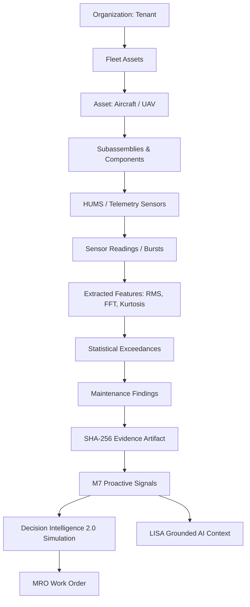

# KOTA Aerospace — Intelligence Graph V1 Reference & Implementation

## 1. Core Principles

1. **PostgreSQL Authoritative Master**: Transactional flight logs, maintenance work orders, compliance obligations, and findings reside strictly in PostgreSQL.
2. **Derived Semantic Graph Representation**: Relational edges connect physical components, sensor logs, and findings to power multi-hop topological reasoning and cross-asset clustering.
3. **Evidence Grounding**: No node or edge represents speculative or fabricated relationships; all assertions cite immutable SHA-256 evidence hashes.

---

## 2. Graph Semantic Model

---

## 3. Cross-Asset Anomaly Correlation (M14.16)

The graph and cross-asset query engine group findings and vibration drift across identical component types across the tenant fleet:
- Identifies recurring component wear before AOG events occur.
- Calculates fleet degradation patterns without crossing tenant boundaries.
- Returns `INSUFFICIENT_DATA` when sample history is below minimum statistical thresholds.
