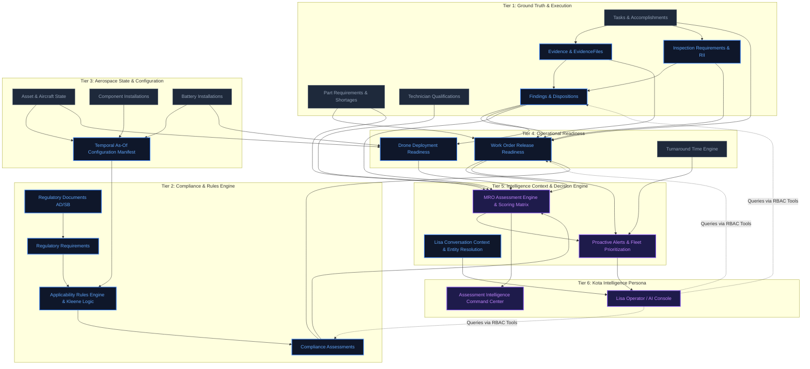

# KOTA AEROSPACE — Developer 2 Architectural Baseline

**Author:** Developer 2 (Aviation Compliance, Reasoning & Intelligence Systems)  
**Date:** September 2026  
**Status:** Read-Only Audit Complete — Baseline Established  
**Scope:** Compliance, Rules, Applicability, Evidence, Inspections/Findings Intelligence, Aerospace State, Readiness, Intelligence Context, Decision Engine, Intelligence UI.

---

## Executive Summary

KOTA AEROSPACE employs a strict two-developer separation of concerns:
- **Developer 1 (Operations & Foundation):** Assets, Aircraft/Drone Core CRUD, Configuration/Genealogy, Component Operations, Missions, Flights, Utilization, Maintenance Programs, Work Orders, Parts/Inventory, Technicians, Operational Cockpit.
- **Developer 2 (Compliance, Reasoning & Intelligence):** Regulatory Compliance, Rules Engine, Applicability, Evidence & Verification, Inspections & Findings Intelligence, Aerospace Temporal State, Readiness Aggregation, Intelligence Context, Deterministic Decision Engine, and Intelligence UI (Lisa & Command Centers).

This document establishes the verified baseline of what exists, what is partial, what is architected only, and what is missing across Developer 2's domain.

---

## 1. Domain Ownership & Boundary Classification

| Domain Module | Status Classification | Notes |
| :--- | :--- | :--- |
| **Evidence Repository & Files** | **COMPLETE** (Task-level) / **PARTIAL** (Docs) | Evidence metadata + MinIO/S3 object storage with SHA-256 integrity exists for tasks. Document/assessment linkage is missing. |
| **Inspection Requirements** | **COMPLETE** (MRO) / **PARTIAL** (Bulk Query) | Checklist review vs RII independence fully enforced. Lacks bulk fleet query endpoint. |
| **General Findings & Disposition** | **COMPLETE** (CRUD/Lifecycle) | `Finding` & `FindingDisposition` models with asset/work order linkage fully functional. |
| **Finding Intelligence** | **ARCHITECTED ONLY** | Fleet recurrence, repeat defect clustering, and MTBF are not implemented. |
| **Regulatory Documents** | **PARTIAL** (Manual DB) / **MISSING** (Live Sync) | Table exists with `source_status`, but sync adapters for DGCA/FAA/EASA are `NOT_CONFIGURED`. |
| **Regulatory Requirements** | **COMPLETE** (Model/CRUD) | Authority, requirement numbers, and citations fully modeled and tenant-scoped. |
| **Compliance Assessment** | **PARTIAL** (Manual determinations) | Manual recording of compliance and human override exists. No automated evaluation. |
| **Applicability Rules Engine** | **MISSING** (Backend) / **MOCK** (Frontend) | Condition-tree combinators (`AND`/`OR`/`NOT`) are mocked in frontend; backend explicitly deferred. |
| **Kleene 3-Valued Logic Engine** | **MOCK** (Frontend) / **MISSING** (Backend) | Evaluates `TRUE`, `FALSE`, `UNKNOWN` per Invariant #23 in frontend; absent in backend. |
| **Aerospace State (Temporal)** | **PARTIAL** (Intervals) / **MISSING** (As-Of) | Historical intervals exist, but no unified temporal "as-of timestamp" configuration query exists. |
| **Release Readiness (Work Order)**| **COMPLETE** (Deterministic Aggregator) | Evaluates Evidence, Inspection, Tasks, Material, Compliance, and Findings blockers cleanly. |
| **Deployment Readiness (Drone)** | **COMPLETE** (Deterministic Aggregator) | Evaluates Battery, Maintenance Due, Inspections, and Findings blockers cleanly. |
| **MRO Assessment Intelligence** | **COMPLETE** (Engine, Snapshots, Roadmap) | Deterministic scoring across 10 categories generating versioned snapshots and roadmaps. |
| **Proactive Alerts & Daily Brief**| **BROKEN** (Integration Signature Drift) | Expects `list_work_orders` to return `list`, but Developer 1 updated it to return `(items, total)`. |
| **Lisa Deterministic Planner** | **COMPLETE** (Intent & Tool Loop) | Bounded tool execution (max 6 calls), ResultGraph generation, and structured reporting. |
| **Lisa LLM Agent & Safety Guard**| **COMPLETE** (Safety) / **UNCONFIGURED** (LLM)| External airworthiness refusal guards are solid; LLM provider requires `ANTHROPIC_API_KEY`. |
| **Neo4j Knowledge Graph** | **ARCHITECTED ONLY** (Zero Python code) | Configured in settings and docker-compose, but completely uninstantiated in code. |

---

## 2. Developer 2 Dependency Graph

The compliance and intelligence reasoning engine flows strictly bottom-up. Lower tiers represent physical execution and ground facts; higher tiers synthesize these facts into deterministic decisions and operational advice:

---

## 3. Detailed Component Audit (A through J)

### A. Current Architecture
1. **Source of Truth:** PostgreSQL 16 is the 100% authoritative store for all tenant, operational, compliance, assessment, and audit data.
2. **Neo4j Graph Database:** Configured in `backend/app/core/config.py` and `docker-compose.yml`, but completely unutilized. There are zero Neo4j driver calls, zero models, and zero queries in the application.
3. **Safety-Guarded Intelligence:** Lisa and the assessment engine follow the "never predict airworthiness" principle. External deterministic safety guards (`backend/app/services/ai/safety.py`) intercept and refuse airworthiness/release determinations before reaching any LLM.
4. **Tenant Scoping:** All tables utilize `TenantScopedMixin` (`organization_id`), enforced server-side.

### B. Existing Implementation
- **Evidence Service (`backend/app/services/evidence_service.py`):** State machine (`REQUIRED` $\rightarrow$ `UPLOADED` $\rightarrow$ `SUBMITTED` $\rightarrow$ `AWAITING_REVIEW` $\rightarrow$ `ACCEPTED` / `REJECTED`). `satisfies_completion_gate()` verifies that only `ACCEPTED` evidence clears gates.
- **Evidence Files (`backend/app/services/evidence_file_service.py`):** Object storage abstraction supporting MinIO / AWS S3 with SHA-256 integrity verification, tenant-scoped storage keys, and reconciliation.
- **Inspections (`backend/app/services/inspection_service.py`):** Checklist reviews vs. RII (Required Inspection Items). Enforces that an RII inspector must be independent of task execution / evidence uploaders.
- **Findings & Dispositions (`backend/app/services/finding_service.py`):** Universal defect logging (`Finding`) linked to assets, work orders, tasks, and components, with historical `FindingDisposition` records.
- **Release Readiness (`backend/app/services/release_readiness_service.py`):** Authoritative gate aggregating `EVIDENCE`, `INSPECTION`, `TASK_EXECUTION`, `MATERIAL`, `COMPLIANCE`, and `FINDING` blockers.
- **MRO Assessment Engine (`backend/app/services/assessment/engine.py`):** Deterministic evaluation across 10 operational categories producing immutable versioned `AssessmentSnapshot` records, materiality scoring, complexity bands, and roadmaps.
- **Lisa Intent Orchestrator (`backend/app/services/lisa/orchestration_service.py`):** Classifies user intent and dispatches bounded tool workflows without LLM hallucination.

### C. Missing Functionality
1. **Applicability Rules Engine (Backend):**
   - No condition-tree evaluation in backend (`ApplicabilityCondition` / `ApplicabilityRule` with `AND`/`OR`/`NOT` combinators over `AIRCRAFT_TYPE`, `MSN_RANGE`, `ENGINE_TYPE`, `MOD_STATUS`).
   - The frontend has Kleene 3-valued logic (`frontend/lib/mock/kleene.ts`), but the backend only has manual `ComplianceAssessment` rows.
2. **Evidence-to-Compliance Linkage:**
   - `Evidence` only attaches to `Task` (`task_id`). There is no mechanism to attach evidence directly to a `ComplianceAssessment` or `ApplicabilityRule`.
3. **Automated Regulatory Ingestion:**
   - No synchronization adapters for DGCA, FAA, EASA, or UK CAA feeds; `sync_status` is hardcoded to `NOT_CONFIGURED`.
4. **Temporal As-Of Configuration Query:**
   - No unified service reconstructs an aircraft's complete configuration (installed engines, components, embodied mods) as of an arbitrary historical timestamp $T$.
5. **Fleet-Wide Finding Intelligence:**
   - No cross-fleet pattern detection (e.g., repeat defect analysis, component failure clustering, mean-time-between-findings).

### D. Database Gaps
To implement the full Developer 2 reasoning pipeline, the following schema additions will be required:
1. `applicability_rules`: Rule metadata, target `regulatory_requirement_id`, versioning, active status.
2. `applicability_conditions`: Condition tree nodes (`condition_type`: `AND`, `OR`, `NOT`, `MSN_RANGE`, `AIRCRAFT_VARIANT`, `ENGINE_TYPE`, `COMPONENT_PN`, `MOD_STATUS`, etc.), parent/child tree hierarchy, criteria payload (`JSONB`).
3. `applicability_assessments`: Immutable evaluation runs recording `rule_id`, `rule_version`, `subject_type`, `subject_id`, `system_result` (`APPLICABLE`, `NOT_APPLICABLE`, `INSUFFICIENT_DATA`, `REVIEW_REQUIRED`), `configuration_snapshot` (`JSONB`), `data_version`, `reasoning_trace` (`JSONB`), `human_decision`, `override_reason`.
4. Evidence linkage expansion: Make `Evidence.task_id` optional and add `compliance_assessment_id` or `applicability_assessment_id`.

### E. API Gaps
1. `POST /api/v1/applicability/evaluate`: Evaluates an asset against a regulatory rule tree using Kleene 3-valued logic.
2. `GET /api/v1/inspections`: Bulk fleet inspection queue (currently only `GET /work-orders/{id}/inspections` exists, forcing the frontend to fan out per work order).
3. `GET /api/v1/release-readiness`: Bulk fleet-wide release readiness queue (currently only per-work-order).
4. `GET /api/v1/findings/analytics`: Fleet-wide defect patterns, recurrence rates, and cluster discovery.

### F. Frontend Gaps
1. `frontend/app/(app)/assessments/page.tsx`: Currently 100% mock data. Lacks REAL-mode API integration.
2. `frontend/app/(app)/evidence/page.tsx`: Currently 100% mock data. Lacks REAL-mode API integration with `evidenceApi` and `evidenceFilesApi`.
3. `frontend/app/(app)/maintenance/release-readiness/page.tsx`: Fleet release readiness queue is mock-only.
4. `frontend/app/(app)/regulations/page.tsx`: Applicability condition tree viewer is mock-only.

### G. Test Gaps
1. No backend unit tests for 3-valued Kleene applicability logic.
2. No integration test verifying end-to-end configuration change $\rightarrow$ applicability reassessment.
3. Pre-existing test fixture bug in `tests/integration/test_release_readiness_full_chain.py` (duplicate active subscription creation triggers ambiguous entitlement).

### H. Security & Governance Gaps
1. **Circular Import:** `work_order_service.py` top-level import of `inspection_service.satisfies_completion_gate` causes `ImportError` on isolated test runs.
2. **Missing Granular Permissions:** No dedicated `COMPLIANCE_OVERRIDE` permission exists; overrides currently rely on generic write access.

### I. Integration Points with Developer 1
Developer 2 **consumes** Developer 1 entities as read-only inputs:
- `Aircraft` & `Asset` $\rightarrow$ Evaluated for compliance, readiness, and assessments.
- `ComponentInstallation` & `BatteryInstallation` $\rightarrow$ Evaluated to construct temporal configuration snapshots.
- `WorkOrder` & `Task` $\rightarrow$ Evaluated for task execution gates, inspection gates, and evidence gates.
- `PartRequirement` $\rightarrow$ Evaluated for material readiness blockers.
- `TechnicianQualification` $\rightarrow$ Evaluated for technician authorization blockers.
- **Contract Integrity:** Developer 1 must not alter method signatures of public query functions without coordinating with Developer 2 (e.g. the pagination tuple change in `list_work_orders` broke `proactive_service.py` and `control_center_service.py`).

### J. Safe vs. Protected Ownership Boundary

#### Files Safe for Developer 2 to Own:
- `backend/app/models/compliance.py`
- `backend/app/models/regulatory_document.py`
- `backend/app/models/assessment.py`
- `backend/app/models/evidence.py`
- `backend/app/models/inspection_requirement.py`
- `backend/app/models/finding.py`
- `backend/app/models/lisa_conversation_context.py`
- `backend/app/services/compliance_service.py`
- `backend/app/services/regulatory_service.py`
- `backend/app/services/assessment/` (all files)
- `backend/app/services/evidence_service.py`
- `backend/app/services/evidence_file_service.py`
- `backend/app/services/evidence_reconciliation_service.py`
- `backend/app/services/inspection_service.py`
- `backend/app/services/finding_service.py`
- `backend/app/services/release_readiness_service.py`
- `backend/app/services/readiness_service.py`
- `backend/app/services/proactive_service.py`
- `backend/app/services/control_center_service.py`
- `backend/app/services/ai/` (all files)
- `backend/app/services/lisa/` (all files)
- `backend/app/api/v1/compliance.py`
- `backend/app/api/v1/regulatory.py`
- `backend/app/api/v1/assessments.py`
- `backend/app/api/v1/evidence.py`
- `backend/app/api/v1/inspections.py`
- `backend/app/api/v1/findings.py`
- `backend/app/api/v1/release_readiness.py`
- `backend/app/api/v1/proactive.py`
- `backend/app/api/v1/control_center.py`
- `backend/app/api/v1/lisa.py`
- `frontend/app/(app)/compliance/`
- `frontend/app/(app)/assessments/`
- `frontend/app/(app)/assessment-intelligence/`
- `frontend/app/(app)/evidence/`
- `frontend/app/(app)/findings/`
- `frontend/app/(app)/regulations/`
- `frontend/app/(app)/ai/`
- `frontend/app/(app)/maintenance/release-readiness/`
- `frontend/app/(app)/maintenance/inspections/`
- `frontend/components/ai/`

#### Files Strictly Owned by Developer 1 (DO NOT MODIFY):
- `backend/app/models/aircraft.py`
- `backend/app/models/aircraft_detail.py`
- `backend/app/models/asset.py`
- `backend/app/models/component.py`
- `backend/app/models/installation_history.py`
- `backend/app/models/battery.py`
- `backend/app/models/flight.py`
- `backend/app/models/mission.py`
- `backend/app/models/work_order.py`
- `backend/app/models/task.py`
- `backend/app/models/part.py`
- `backend/app/models/part_requirement.py`
- `backend/app/models/inventory_transaction.py`
- `backend/app/models/warehouse.py`
- `backend/app/models/procurement_request.py`
- `backend/app/models/purchase_order.py`
- `backend/app/models/vendor.py`
- `backend/app/models/vendor_part_availability.py`
- `backend/app/models/aog_event.py`
- `backend/app/models/deferred_item.py`
- `backend/app/models/maintenance_requirement.py`
- `backend/app/models/facility.py`
- `backend/app/services/aircraft_service.py`
- `backend/app/services/asset_service.py`
- `backend/app/services/component_service.py`
- `backend/app/services/installation_service.py`
- `backend/app/services/battery_service.py`
- `backend/app/services/flight_service.py`
- `backend/app/services/mission_service.py`
- `backend/app/services/work_order_service.py`
- `backend/app/services/part_service.py`
- `backend/app/services/part_requirement_service.py`
- `backend/app/services/inventory_transaction_service.py`
- `backend/app/services/warehouse_service.py`
- `backend/app/services/procurement_service.py`
- `backend/app/services/purchase_order_service.py`
- `backend/app/services/vendor_service.py`
- `backend/app/services/vendor_fit_service.py`
- `backend/app/services/vendor_part_availability_service.py`
- `backend/app/services/aog_service.py`
- `backend/app/services/aog_recovery_service.py`
- `backend/app/services/deferred_item_service.py`
- `backend/app/services/maintenance_service.py`
- `backend/app/services/facility_service.py`
- `backend/app/services/tat_service.py`
- `frontend/app/(app)/aircraft/`
- `frontend/app/(app)/assets/`
- `frontend/app/(app)/components/`
- `frontend/app/(app)/drones/`
- `frontend/app/(app)/maintenance/work-orders/`
- `frontend/app/(app)/maintenance/parts/`
- `frontend/app/(app)/procurement/`
- `frontend/app/(app)/fleet/`

---

## 4. Recommended Implementation Order

### Milestone 1: Stability & Foundation Integration
1. Resolve the circular import between `work_order_service.py` and `inspection_service.py`.
2. Adapt `proactive_service.py` and `control_center_service.py` to handle `work_order_service.list_work_orders` pagination tuples (`(items, total)`).
3. Fix test fixture multi-subscription ambiguity in `tests/integration/test_release_readiness_full_chain.py`.

### Milestone 2: Backend Applicability Rules & Kleene Evaluation Engine
1. Port 3-valued Kleene logic (`TRUE`, `FALSE`, `UNKNOWN`) into `backend/app/services/applicability/kleene.py`.
2. Implement condition-tree evaluation engine over aircraft variant, MSN range, engine model, and component part numbers.
3. Expose `POST /api/v1/applicability/evaluate`.

### Milestone 3: Real Evidence & Assessment Frontend Integration
1. Connect `frontend/app/(app)/assessments` to `assessmentsApi` with REAL/DEMO mode support.
2. Connect `frontend/app/(app)/evidence` to `evidenceApi` and `evidenceFilesApi`.
3. Add fleet-level release readiness endpoint (`GET /api/v1/release-readiness`) and connect `maintenance/release-readiness`.

### Milestone 4: Finding Intelligence & Fleet Recurrence Engine
1. Implement defect clustering and recurrence analytics in `finding_service.py`.
2. Expose `GET /api/v1/findings/analytics`.
3. Add finding intelligence visualization to `frontend/app/(app)/findings`.

### Milestone 5: Proactive Intelligence & Decision Support
1. Re-wire Lisa's proactive fleet priorities and daily brief to live PostgreSQL signals.
2. Implement structured multi-turn conversation caching in `lisa_conversation_contexts`.
