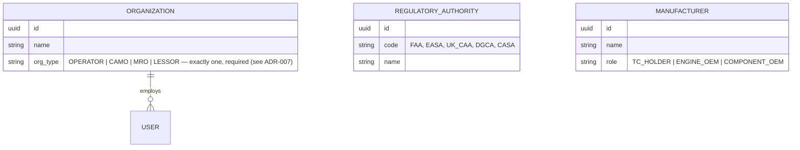
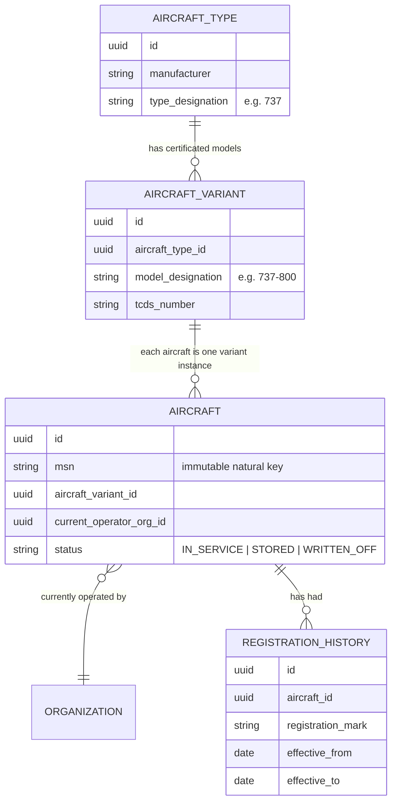
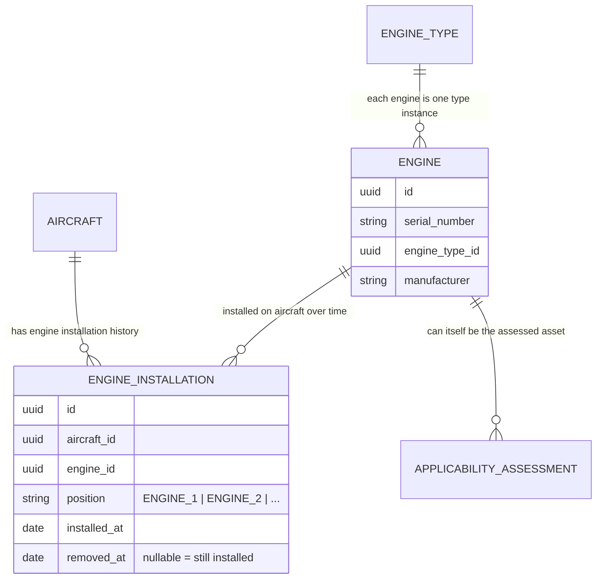
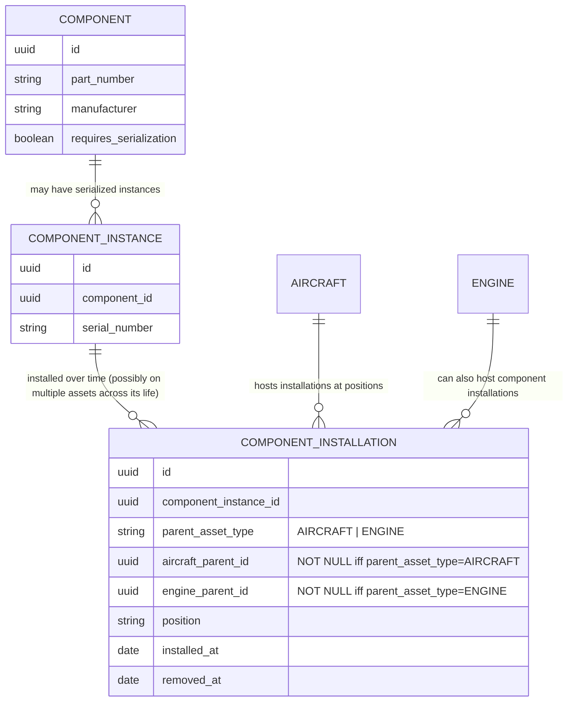
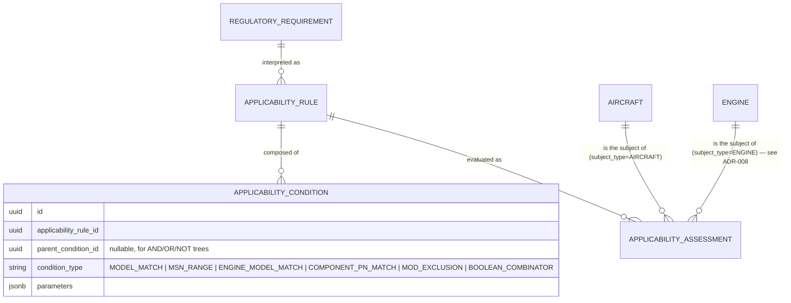
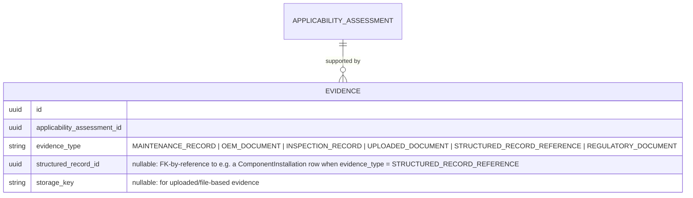
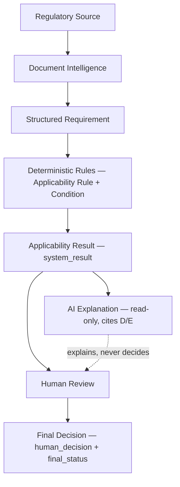
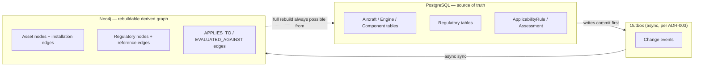

# AeroComply Aviation Ontology v1.0

Status: **Proposed — awaiting CTO approval. No implementation code has been written against this document.**

This document is the domain model for AeroComply's continuing-airworthiness and regulatory-applicability product. It is written from real aviation regulatory structure (ICAO Annex 6/8; FAA 14 CFR Parts 21/39/43/91/121/145; EASA Part-21/Part-M/Part-ML/Part-CAMO/Part-145/Part-66; UK CAA retained-EASA framework; India DGCA Aircraft Rules/CARs; CASA Australia CASR Part 39/42) — not from a generic CRUD/asset-tracking mental model. Terms used here are defined precisely in [DOMAIN_GLOSSARY.md](DOMAIN_GLOSSARY.md); read that first if a term's meaning is unclear.

---

## 1. Organizations

### Research finding
Every jurisdiction studied recognizes overlapping but distinct organizational roles in continuing airworthiness:
- **Operator** — operates the aircraft (FAA: holds 14 CFR 91.403 responsibility directly, or contracts it out; EASA/UK: may delegate to a CAMO).
- **CAMO** — EASA/UK Part-CAMO concept: manages continuing airworthiness, decides what maintenance is due, issues Airworthiness Review Certificates. No exact FAA equivalent term, but the *function* exists wherever a 14 CFR 121/135 operator runs a Continuous Airworthiness Maintenance Program (CAMP).
- **MRO** — performs maintenance (FAA Part 145 / EASA Part-145). A distinct approval from CAMO; one company can hold both.
- **Leasing company** — often the *legal owner*, distinct from the operator, with contractual (not regulatory) interest in configuration/compliance status (return conditions, e.g.).
- **OEM** — manufacturer; issues SBs, provides eligibility data, sometimes provides original engineering data behind an AD.
- **Regulatory Authority** — FAA, EASA, UK CAA, DGCA, CASA, etc. — issues/enforces requirements. Not a *tenant* of AeroComply (no authority will use our SaaS to manage their own regulations) but is referenced constantly as the *source* of regulatory data.

### Decision: shared base abstraction, not one collapsed entity
All tenant-facing roles (Operator, CAMO, MRO, Leasing Company) share one `Organization` table with an `org_type` discriminator, because:
1. They share every structural need AeroComply actually has for them in M1 — multi-tenant isolation, users, roles, audit trail.
2. A rigid separate-table-per-role model would force multi-inheritance or duplicate records the moment two roles need the exact same underlying infrastructure (tenancy, users, audit trail) — which every role here does. Real companies can hold more than one role simultaneously (an airline that is both operator and its own CAMO); M1 deliberately does not attempt to represent that (an organization registers under one primary `org_type`, per [ADR-007](../adr/ADR-007-organization-shared-base-abstraction.md)'s post-review amendment) — but *if and when* that's needed, the fix is an additive `OrganizationRole` child table, not a redesign of this shared-table decision.
3. `Regulatory Authority` and `OEM` are **not** organizations in the tenant sense — they are *referenced* entities (source of documents, source of eligibility data), never log in, never hold `users`/`roles`. Modeling them as `Organization` rows would incorrectly imply they're SaaS tenants. They get their own reference entities: `RegulatoryAuthority` (already exists from M0 groundwork) and a deferred `Manufacturer`/OEM reference (M1 core, but as a lightweight lookup, not a full Organization).



**Why Regulatory Authority and Manufacturer are excluded from `Organization`**: including them would force every future authorization/permission check to special-case "except when the organization is actually a regulator or OEM" — a correctness hazard for exactly the same reason M0's RBAC was built as an explicit permission catalog rather than ad hoc role checks.

---

## 2. Aircraft

### Precise definitions (see glossary for full detail)
- **Aircraft Type** — the Type Certificate family (e.g., "Boeing 737", "Airbus A320").
- **Aircraft Variant** (a.k.a. Model / TMS — Type/Model/Series) — a specific certificated model within that family with its own TCDS entry (e.g., 737-800, A320-200, A320neo). **This is the level most AD applicability is actually written against**, not the parent Type — a critical modeling detail research surfaced: an AD applicability paragraph almost never says "applies to all Boeing 737s"; it says "applies to Model 737-800 aircraft" or similar, often further narrowed by MSN range.
- **Aircraft** — one physical instance, uniquely and permanently identified by MSN, currently carrying one Registration (which can change) and operated by one Operator (which can change).
- **Aircraft Configuration** — not a stored entity; the derived, as-of-timestamp result of installed engines + installed components + embodied modifications for one Aircraft.

### Why Type ≠ Variant ≠ Aircraft ≠ Configuration must be four distinct concepts
Collapsing Type and Variant loses the exact level applicability rules are written at (we'd either over-apply a rule meant for one variant to a whole type family, or have no clean place to encode variant-specific eligibility). Collapsing Aircraft and Configuration loses history — an Aircraft's *identity* (MSN) is permanent, but its *configuration* changes over its operational life and must be reconstructable for any past date, which requires configuration to be a query, not a field.



Registration is modeled as a **history table**, not a field on `Aircraft`, precisely because it changes and past registrations remain historically relevant (an AD compliance record from 2019 referenced the aircraft's registration *at that time*, which may since have changed on resale).

---

## 3. Engines

### Research finding
Every authority studied treats an installed engine as subject to **both** its own AD/SB regime (engine ADs are issued against the engine's own Type Certificate, separately from the airframe's TC) **and** as a configuration factor in airframe-level AD applicability (an airframe AD frequently says "applies to Model X aircraft equipped with Engine Model Y"). An engine is also, itself, host to serialized life-limited parts with their own independent life tracking that survives an engine change (an LLP moved from a life-expired engine into a different engine still carries its cumulative life).

### Decision: Engine is a first-class asset, not merely a Component
Reasoning:
1. An engine has its own Type Certificate and its own independent AD/SB applicability stream — a `Component`'s applicability in our model is currently only evaluated in the context of the parent aircraft's applicability rules (M1 scope), but an engine needs to support **its own** applicability assessments as a subject in its own right, symmetric to how `Aircraft` does. Treating it as "just a component" would mean building a second, parallel mechanism later to give components AD applicability of their own — a schema break the CTO's directives explicitly want avoided (cf. the AD→SB precedent in ADR-006).
2. An engine has a well-defined **position** (e.g., Engine 1, Engine 2) on the aircraft, and its own installation/removal history — structurally identical to how a serialized `Component` is installed on the aircraft. So while Engine is first-class for applicability purposes, its **installation relationship to the aircraft reuses the same `Installation` pattern as components** (see §4) rather than inventing a separate mechanism — avoiding both "engine is just a component" (loses its independent applicability) and "engine needs a wholly separate installation model" (unnecessary duplication).



---

## 4. Components

### Critical analysis: are Component, Part, Serialized Component, and Installation Event separate concepts?

Research finding — yes, and collapsing any two of them produces a real correctness defect:

| Concept | What it actually is | What breaks if collapsed with another |
|---|---|---|
| **Part** (design) | A part number: an interchangeable design, independent of any physical instance | If collapsed with "Component," we lose the ability to represent that many physical items share one design |
| **Component** | AeroComply's chosen term for the *design-level* entity — synonymous with Part in our usage (see glossary: we deliberately equate them to avoid inventing a third redundant term) | — |
| **Serialized Component Instance** | One specific physical item of a Component/Part, identified by serial number — **only exists for parts that are individually serialized**; many parts are batch/lot-tracked with no per-unit identity | If collapsed with "Component," every part row would need a nullable serial number and we could never enforce "this class of part must always be serialized" as a real constraint; also cannot represent "this exact physical unit was removed from Aircraft A and later installed on Aircraft B" |
| **Installation (event/period)** | A *time-bounded fact* relating one Serialized Component Instance to one position on one parent asset | If collapsed with "Serialized Component Instance," we lose the ability to represent the same physical part's multiple installation periods across its service life (removed from one aircraft, later installed on another) — exactly the historical-reconstruction requirement the CTO's temporal-model directive demands |

**Decision: four distinct concepts, three of them modeled as tables** — `Component` (design/part), `ComponentInstance` (the serialized physical unit — only created for components requiring serialization), and `ComponentInstallation` (the time-bounded installation fact). "Part" is not a fourth table; it is the same concept as `Component` under a different common name, and modeling it separately would be a synonym duplication, not a real distinction — confirmed by checking: does any authority's regulatory text distinguish "part" from "component" in a way that requires different *behavior*, not just different *vocabulary*? No — both FAA and EASA use "part" and "component" close to interchangeably in the continuing-airworthiness context (14 CFR 43 uses "part"; EASA Part-M uses "component"); the distinction that *does* matter (serialized vs. not) is captured by whether a `ComponentInstance` row exists, not by a separate "Part" table.



**Referential integrity (revised per CTO review)**: the original design used a single untyped `parent_asset_id` + `parent_asset_type` pair — a UUID with no real foreign key, since it could point at either `Aircraft` or `Engine` depending on the string value, meaning the database itself could not enforce that the referenced row actually exists or is of the claimed type. This is corrected to the same **typed, dual-column** pattern already used for `ApplicabilityAssessment`'s polymorphic subject (ADR-008): two separate, individually-real foreign key columns (`aircraft_parent_id → Aircraft.id`, `engine_parent_id → Engine.id`), exactly one of which is populated per row, enforced by:

```sql
CHECK (
  (parent_asset_type = 'AIRCRAFT' AND aircraft_parent_id IS NOT NULL AND engine_parent_id IS NULL)
  OR
  (parent_asset_type = 'ENGINE'   AND engine_parent_id IS NOT NULL AND aircraft_parent_id IS NULL)
)
```
plus real `FOREIGN KEY` constraints on both `aircraft_parent_id` and `engine_parent_id` (each nullable, but never both null and never both populated). This is the same reasoning ADR-008 already applied to `ApplicabilityAssessment.subject_type` — the CTO's review correctly identified that `ComponentInstallation` had been left with the *weaker*, untyped version of the same polymorphism problem despite the stronger pattern already existing elsewhere in the ontology for the identical shape of problem. See [ADR-008](../adr/ADR-008-engine-first-class-asset.md)'s "Worked demonstration" section, which now applies to both entities.

A non-serialized `Component` (e.g., a standard bolt lot) is tracked only by part number/quantity at the maintenance-record level (§8, Evidence) and never gets a `ComponentInstance` row — deliberately, so we never fabricate a false sense of individual traceability the real world doesn't have for that part.

---

## 5. Configuration History (temporal model summary — full detail in [TEMPORAL_MODEL.md](TEMPORAL_MODEL.md))

The worked example from the CTO's brief:
```
Aircraft A
  Engine X installed: 01 Jan 2026 → 15 May 2026
  Engine Y installed: 15 May 2026 → Present
```
is directly representable as two `ENGINE_INSTALLATION` rows (`removed_at` null for the current one), and "what engine did Aircraft A have on 1 March 2026?" is answered by:
```sql
SELECT engine_id FROM engine_installation
WHERE aircraft_id = 'A' AND position = 'ENGINE_1'
  AND installed_at <= '2026-03-01'
  AND (removed_at IS NULL OR removed_at > '2026-03-01');
```
The same pattern generalizes to `ComponentInstallation` and to the aircraft's variant/modification state — "Aircraft Configuration as of T" is always this kind of as-of query across installation-history tables, never a mutable "current state" row that could silently drift out of sync with history. This is the single most important invariant of the whole ontology and is why every installation-type table above is designed as an *interval* (`installed_at`/`removed_at`), not a foreign key with no time dimension.

---

## 6. Regulatory Domain

Already substantially established in [FOUNDATION.md](../../FOUNDATION.md) §3/§4a and [ADR-006](../adr/ADR-006-regulatory-requirement-core-abstraction.md): `RegulatoryAuthority → RegulatoryDocument → RegulatoryRequirement`, with `RegulatoryDocument` carrying full provenance (revision, publication/effective date, source URL, retrieval timestamp, content hash, supersession chain) and `RegulatoryRequirement.requirement_type` discriminating AD/SB/Regulation/Rule/AMC/GM/SIB/Notice — this ontology does not re-litigate that decision, only extends it with the applicability-chain detail below.

**Research-driven refinement**: an AD's applicability paragraph is not free text once structured — it decomposes into a small number of recurring predicate shapes across every authority studied: TC-holder/model match, MSN or serial-range match, installed-engine-model match, installed-component-part-number match, and an "unless already modified per [SB/mod reference]" exclusion. §7 below formalizes this as `ApplicabilityCondition`.

---

## 7. Applicability (AeroComply's core IP)

Five concepts, kept strictly separate (rationale for each pairing already given in the glossary; restated here as the authoritative chain):


- **Regulatory Requirement** — the published obligation (already in FOUNDATION.md).
- **Applicability Rule** — the structured predicate tree, versioned, human-authored from the requirement's text.
- **Applicability Condition** — one atomic predicate node inside a Rule's tree (new concept this ontology adds explicitly as its own entity, not just an anonymous JSON leaf, because conditions are the unit evidence and explanation need to reference individually — "this assessment is APPLICABLE because condition 'engine_model = CFM56-7B' matched" is a stronger, more auditable explanation than pointing at an entire rule blob).
- **Applicability Assessment** — the deterministic engine's output against one aircraft's configuration-as-of-evaluation-time (already established in FOUNDATION.md §4b with system/human/final separation — this ontology does not change that design, only grounds *what data* the assessment is evaluated against: the Aircraft's Variant + as-of Engine/Component configuration, per §5).
- **Human Decision** / **Final Status** — already established in ADR-005; unchanged here.



### Worked demonstration: expressiveness of the condition tree

The CTO's review asked us to demonstrate that `ApplicabilityCondition` can represent boolean combinations up to and including a realistic compound AD applicability paragraph. `ApplicabilityCondition` is a self-referencing tree: leaf nodes carry a `condition_type` + `parameters` (a single testable fact), and interior nodes carry a `condition_type` of `AND` / `OR` / `NOT` with `parent_condition_id` links to their children — a standard, minimal boolean expression tree, nothing bespoke.

`A AND B`:
```
AND
├── A
└── B
```

`A OR B`:
```
OR
├── A
└── B
```

`(A OR B) AND C`:
```
AND
├── OR
│   ├── A
│   └── B
└── C
```

`A AND NOT B`:
```
AND
├── A
└── NOT
    └── B
```

The compound example from the CTO's brief:
```
Aircraft Model = X
AND
MSN in range A-B
AND
(
    Engine Model = Y
    OR
    Component P/N = Z
)
AND NOT
Modification M
```
maps directly onto the same tree shape:
```
AND
├── MODEL_MATCH(model = X)
├── MSN_RANGE(min = A, max = B)
├── OR
│   ├── ENGINE_MODEL_MATCH(model = Y)
│   └── COMPONENT_PN_MATCH(part_number = Z)
└── NOT
    └── MOD_EXCLUSION(modification = M)
```
Nothing in this example needs a condition type beyond the six already enumerated in §7's ER diagram (`MODEL_MATCH`, `MSN_RANGE`, `ENGINE_MODEL_MATCH`, `COMPONENT_PN_MATCH`, `MOD_EXCLUSION`, plus the `AND`/`OR`/`NOT` combinators) — this is direct evidence the condition-type enum, as scoped, is sufficient for realistic AD-shaped applicability text, not just the trivial examples.

**Important boundary (CTO review, post-v1.0): this example must not be read as claiming M1 can always *evaluate* `MOD_EXCLUSION`.** The tree above shows the condition type is *representable* — a `MOD_EXCLUSION` leaf can always be authored into a rule, because `RegulatoryRequirement.references_requirement_id` and free-form `type_metadata` already exist to capture the exclusion's textual/reference content (per [M1_SCOPE.md](M1_SCOPE.md)). But **M1 explicitly defers a first-class, queryable `Modification`/STC entity** (§15 of the CTO's original brief; see M1_SCOPE.md's "Explicitly deferred" table). This means a `MOD_EXCLUSION` leaf's *evaluation* — actually determining whether Modification M is embodied on a given aircraft — has no structured data source to consult in M1. Per domain invariant #23 ("unknown is not false"), the correct evaluator behavior when it encounters a `MOD_EXCLUSION` condition it has no way to resolve is to return `UNKNOWN` for that leaf, which propagates through the `AND`/`NOT` combinators to an overall `system_result = INSUFFICIENT_DATA` (or `REVIEW_REQUIRED`, if a human has already logged the aircraft's mod status out-of-band as `Evidence`) — **never** a silent assumption that the modification is absent (which would wrongly conclude the rule applies) or present (which would wrongly conclude it doesn't). Until Modification/STC is a first-class M2 entity, any rule containing a `MOD_EXCLUSION` condition should be expected to produce `INSUFFICIENT_DATA`/`REVIEW_REQUIRED` for most aircraft in M1, by design — that is the conservative, correct behavior, not a defect to work around.

**Why this remains deterministic, versionable, auditable, and safe** (explicitly, per the CTO's requirement — no rules engine is being implemented here, only the data shape that will eventually drive one):
- **Deterministic**: every leaf node is a pure, side-effect-free predicate over structured aircraft/engine/component data (no natural-language interpretation, no LLM involvement anywhere in this tree — consistent with ADR-004); evaluating the same tree against the same data always produces the same boolean result.
- **Versionable**: the tree hangs off one `ApplicabilityRule.rule_version` (already established in FOUNDATION.md §12); a corrected interpretation is a new rule version with its own new condition tree, never an in-place edit to an existing tree — matching domain invariant #14 (only one active rule version per requirement at a time).
- **Auditable**: because each leaf `ApplicabilityCondition` is its own row, an `ApplicabilityAssessment`'s `reasoning` trace can cite the *specific condition* that matched or failed (e.g., "MSN_RANGE condition #4821 matched: MSN 1234 is within [1001, 1500]"), not just "the rule matched" — this is a materially stronger explanation than treating the whole predicate as an opaque JSON blob, and it's the reason `ApplicabilityCondition` was introduced as its own entity rather than staying folded into `ApplicabilityRule.predicate` as originally sketched in FOUNDATION.md §4.
- **Safe**: the tree has no operators capable of anything beyond boolean evaluation over already-structured, already-validated data — no arbitrary code execution, no natural-language matching, no floating nondeterminism (e.g., no "approximately equals" fuzzy operators in this version). If a real-world requirement's applicability text cannot be expressed with these condition types, the correct response is `REVIEW_REQUIRED`/`INSUFFICIENT_DATA` from a human rule author, never a best-effort approximate match.

### Worked demonstration: the assessment-history chain stays auditable

The CTO's review asked us to demonstrate the full chain `RegulatoryRequirement → ApplicabilityRule → ApplicabilityAssessment → system_result → Human Decision → Final Decision` with historical auditability preserved. Concretely, for one aircraft/requirement pair over time:

| Event | Row created | `previous_assessment_id` | `system_result` | `human_decision` | `final_status` |
|---|---|---|---|---|---|
| Initial evaluation | Assessment #1 | NULL | APPLICABLE | PENDING | ACTION_REQUIRED (mirrors system) |
| Compliance Manager reviews, accepts | Assessment #2 | #1 | APPLICABLE (unchanged, re-affirmed) | ACCEPTED | ACTION_REQUIRED |
| New evidence surfaces (excluding mod found) → re-evaluation | Assessment #3 | #2 | NOT_APPLICABLE | PENDING | NOT_APPLICABLE (mirrors system) |
| Engineer reviews, accepts | Assessment #4 | #3 | NOT_APPLICABLE | ACCEPTED | NOT_APPLICABLE |

Every row is a distinct, immutable insert (per ADR-005 and domain invariant #16) — nothing here is an `UPDATE`. Answering "what was the compliance state on the date between Assessment #2 and #3" is a lineage walk: find the most recent row (by `created_at`) at-or-before the queried timestamp, which returns Assessment #2's `final_status = ACTION_REQUIRED` — the correct historical answer, unaffected by what Assessment #3/#4 later determined. This is the same mechanism [TEMPORAL_MODEL.md](TEMPORAL_MODEL.md) formalizes for the "historical compliance state" query, demonstrated here end-to-end against the full chain rather than in the abstract.

Nothing in this chain is new relative to ADR-005 — this worked example exists to make the already-approved M0 design's behavior concrete against a realistic aviation scenario (a re-evaluation triggered by new evidence), per the CTO's explicit request to demonstrate it, not to change it.

---

## 8. Evidence

Evidence types found consistently across the researched authorities' record-keeping requirements (ICAO Annex 6 Appendix; FAA 14 CFR 91.417; EASA Part-M.A.305/Part-CAMO.A.220): aircraft/engine/component logbook entries, maintenance release/certificate of release to service (CRS) records, inspection records, OEM documents (SBs, manuals), and the regulatory document itself. AeroComply's own structured records (an installation history row, e.g.) are *also* valid evidence — a compliance conclusion can be evidenced by "our own database says the excluding modification was installed on this date," not only by an uploaded file.



`structured_record_id` is intentionally a loosely-typed reference (not a hard FK to one specific table) because evidence can point at any of several structured tables (installation history, maintenance record, another assessment) — this is the one place in the ontology where a polymorphic reference is the right tool, because the *variety* of evidence types is the entire point of the entity, unlike the Component/Part question in §4 where variety was better resolved by keeping tables distinct.

### Worked demonstration: evidence without becoming a document-management platform

The CTO's review asked us to demonstrate that an assessment can point to evidence without M1 turning into a full document-management/MRO platform. The mechanism is deliberately narrow: `Evidence` is *always* scoped to one `applicability_assessment_id` (never a standalone document library with its own browsing/search/versioning UI), and it has exactly two shapes — a `storage_key` pointing at one uploaded file in object storage (no folder structure, no document metadata beyond `description`/`type`), or a `structured_record_id` pointing at an already-existing row elsewhere in AeroComply's own data (e.g., a `ComponentInstallation` that proves a modification was embodied). There is no `Document` entity, no document versioning, no document workflow/approval process, and no full-text search over uploaded evidence in M1 — all of which would be required features of an actual document-management platform and none of which the core "does X apply to Y, and why" product question needs. If AeroComply later needs a real document-management capability (e.g., OEM manual libraries with revision tracking), that is a deliberately separate, explicitly out-of-M1 product decision — not something this Evidence entity should organically grow into by accumulating fields.

---

## 9. Provenance

Three layers, never conflated (directly extending the M0-established principle from ADR-004 that the AI must never be the decision engine, generalized here to the full regulatory-intelligence pipeline):

1. **SOURCE** — what the authority actually published: `RegulatoryDocument` (revision, publication/effective date, source URL, retrieval timestamp, content hash, language, source status).
2. **INTERPRETATION** — AeroComply's structured reading of that source: `ApplicabilityRule` (+ its `ApplicabilityCondition`s), versioned, human-authored/reviewed, referencing the exact `RegulatoryDocument` revision it was derived from.
3. **DECISION** — what happened for one specific aircraft: `ApplicabilityAssessment` (system) → `Human Decision` → `Final Status`, each carrying the `rule_version`/`regulatory_document_version`/`data_version` triple already established in FOUNDATION.md §4b, plus the immutable `configuration_snapshot` manifest `data_version` is now defined as a hash *of* (per [ADR-010](../adr/ADR-010-configuration-as-derived-temporal-view.md)'s CTO-reviewed amendment — a bare hash with nothing stored to audit against was judged insufficient).

This is not a new mechanism — it is the existing FOUNDATION.md/ADR-004/ADR-005 design, restated here to confirm the aviation ontology's applicability chain (§7) slots into it without modification (aside from the `configuration_snapshot` hardening above), which is itself a validation that the M0 architecture didn't need to change to accommodate real aviation domain complexity.

---

## 10. Human Decision Boundary

Unchanged from ADR-005, extended only by naming where in the aviation-specific pipeline each stage sits:



The AI box (F) has no arrow into H — it feeds *context* to the human reviewing at G, exactly as ADR-004 mandates. This diagram is the same shape as the one already in FOUNDATION.md's Core Engineering Principle; repeated here because the CTO's brief explicitly asked for it in the aviation-ontology deliverable set.

---

## 11. Temporal Model

Full detail in [TEMPORAL_MODEL.md](TEMPORAL_MODEL.md). Summary of the dates that exist in this domain and are **not interchangeable**:

| Date | Belongs to | Meaning |
|---|---|---|
| `installed_at` / `removed_at` | ComponentInstallation, EngineInstallation | Physical configuration interval |
| `effective_date` | RegulatoryDocument | When the document became legally binding |
| `compliance_time` | RegulatoryRequirement | Deadline (or interval) by which affected aircraft must comply |
| `publication_date` | RegulatoryDocument | When the authority published it (may precede effective_date) |
| `revision` date / `supersedes`/`superseded_by` | RegulatoryDocument | Document version history |
| `evaluated_at` | ApplicabilityAssessment | When the rules engine ran |
| `human_decision_at` | ApplicabilityAssessment | When a human acted |

---

## 12. PostgreSQL vs. Neo4j



Per entity family:

| Entity | Postgres (source of truth) | Neo4j (derived) |
|---|---|---|
| Organization, User | Yes | No — no graph traversal need |
| AircraftType, AircraftVariant, Aircraft | Yes | Yes — traversal target for "which aircraft are affected by a config-driven reassessment" |
| Engine, ComponentInstance, *Installation tables | Yes | Yes — the installation graph is exactly the multi-hop traversal ADR-003 was written for |
| RegulatoryAuthority, RegulatoryDocument, RegulatoryRequirement | Yes | Yes — traversal for "which rules reference which requirements" (supersession, AD→SB) |
| ApplicabilityRule, ApplicabilityCondition | Yes | Yes — `APPLIES_TO` edges to AircraftVariant/Engine/Component, per ADR-003's existing graph model |
| ApplicabilityAssessment | Yes | Yes, as a lineage node (`SUPERSEDES` edges) — never as the place a decision is made |
| Evidence | Yes | No — no traversal value found in research; evidence lookup is always assessment-scoped, a simple Postgres join suffices |

No entity is proposed as Neo4j-only. This matches ADR-002/ADR-003 exactly — this ontology introduces no new dual-authority risk.

---

## 13–17. See companion documents

Domain invariants (20+): [DOMAIN_INVARIANTS.md](DOMAIN_INVARIANTS.md). Full ambiguity analysis (industry meaning / AeroComply meaning / rationale / deferred scope for every ambiguous concept): [AMBIGUITY_ANALYSIS.md](AMBIGUITY_ANALYSIS.md), condensed cross-reference in [DOMAIN_GLOSSARY.md](DOMAIN_GLOSSARY.md). MVP boundary: [M1_SCOPE.md](M1_SCOPE.md). Full ER model: [ENTITY_RELATIONSHIP.md](ENTITY_RELATIONSHIP.md). Temporal model: [TEMPORAL_MODEL.md](TEMPORAL_MODEL.md). Modeling ADRs: [docs/adr/](../adr/) ADR-007 through ADR-010.
