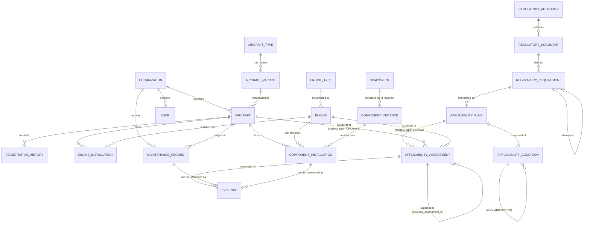

# AeroComply Entity-Relationship Model v1.0 (Aviation Ontology)

Human-readable companion to [AVIATION_ONTOLOGY.md](AVIATION_ONTOLOGY.md). This is the *proposed* M1 aviation entity set layered on top of the M0 foundation (`Organization`, `User`, `Role`, `AuditEvent`, and the already-established `RegulatoryAuthority → RegulatoryDocument → RegulatoryRequirement` chain from FOUNDATION.md/ADR-006). No SQLAlchemy models or migrations exist yet — this is design only.

## Full entity relationship diagram

**Polymorphic relationships note (CTO review, post-v1.0)**: `AIRCRAFT ||--o{ COMPONENT_INSTALLATION` and `ENGINE ||--o{ COMPONENT_INSTALLATION` (and likewise the two `APPLICABILITY_ASSESSMENT` subject relationships above) each represent one of two *typed, mutually-exclusive* foreign key columns, not a single untyped reference — `ComponentInstallation.aircraft_parent_id`/`engine_parent_id` and `ApplicabilityAssessment.aircraft_subject_id`/`engine_subject_id` respectively, each gated by a `CHECK` constraint on a `..._type` discriminator. This diagram's `erDiagram` notation (which has no native way to express "one of these two relationships, enforced by a CHECK constraint") should not be read as implying a single untyped polymorphic FK — see [AVIATION_ONTOLOGY.md §4](AVIATION_ONTOLOGY.md) and [ADR-008](../adr/ADR-008-engine-first-class-asset.md) for the actual column-level design.

## Entity summary table

| Entity | New in M1? | Tenant-scoped? | Source of truth | Graph-represented? |
|---|---|---|---|---|
| Organization | Exists (M0) | N/A (is the tenant) | Postgres | No |
| AircraftType | New | No (shared reference) | Postgres | Yes |
| AircraftVariant | New | No (shared reference) | Postgres | Yes |
| Aircraft | New | Yes | Postgres | Yes |
| RegistrationHistory | New | Yes | Postgres | No |
| EngineType | New | No (shared reference) | Postgres | Yes |
| Engine | New | Yes | Postgres | Yes |
| EngineInstallation | New | Yes | Postgres | Yes |
| Component | New | No (shared reference — a part design is not tenant-specific) | Postgres | Yes |
| ComponentInstance | New | Yes (a physical unit belongs to whoever owns/tracks it) | Postgres | Yes |
| ComponentInstallation | New | Yes | Postgres | Yes |
| RegulatoryAuthority | Exists (M0) | No | Postgres | Yes |
| RegulatoryDocument | Exists (M0) | No | Postgres | Yes |
| RegulatoryRequirement | Exists (M0, schema-reserved) | No | Postgres | Yes |
| ApplicabilityRule | Exists (M0, schema-reserved) | No | Postgres | Yes |
| ApplicabilityCondition | New | No | Postgres | Yes |
| ApplicabilityAssessment | Exists (M0, schema-reserved) | Yes | Postgres | Yes (lineage only) |
| Evidence | New | Yes | Postgres | No |
| MaintenanceRecord | New | Yes | Postgres | No |

"Exists (M0, schema-reserved)" means FOUNDATION.md's §4 schema proposal already named the table/columns; this ontology confirms and extends the design without contradicting it, and no migration has yet been written for any of them.

## Why some reference entities are explicitly NOT tenant-scoped

`AircraftType`, `AircraftVariant`, `EngineType`, and `Component` are shared, global reference data — a Boeing 737-800's certification facts, or a given part number's design facts, are not different per tenant. This mirrors the M0-established pattern for `RegulatoryAuthority`/`RegulatoryDocument`/`RegulatoryRequirement`/`ApplicabilityRule` (FOUNDATION.md §9): every organization sees the same underlying aviation reference facts; only their own fleet, installations, assessments, and evidence are tenant-owned. Getting this boundary wrong in either direction is a real risk — over-scoping reference data to tenants would prevent healthy data reuse and create redundant/inconsistent copies of the same aircraft-type facts across tenants; under-scoping operational data (e.g., accidentally sharing `Aircraft` rows across tenants) would be a severe tenant-isolation defect. This table exists precisely so that boundary is a reviewed, explicit decision rather than an implementation-time guess.
