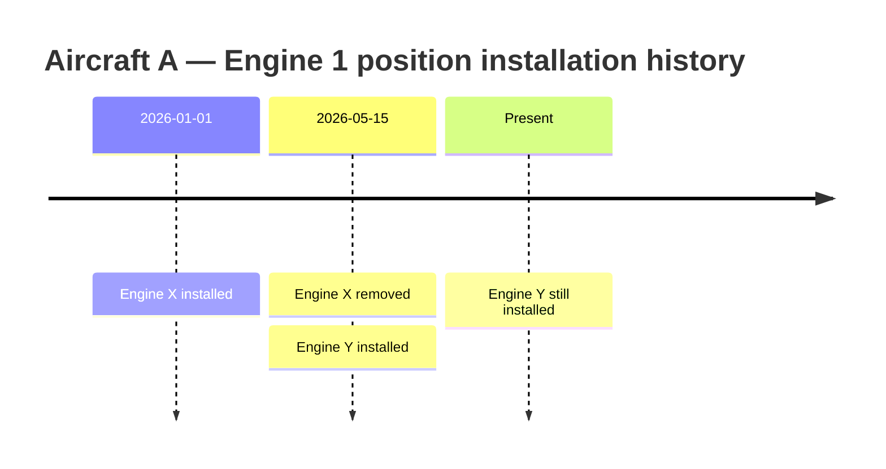

# AeroComply Temporal Model v1.0

This document formalizes how AeroComply represents time-varying aviation facts so that both "what is true now" and "what was true at time T" (an explicit, recurring CTO requirement since the M0 gate) are answerable from the same underlying data, without a separate historical-tracking mechanism bolted on afterward.

## The core pattern: interval tables, not point-in-time fields

Every fact in the ontology that changes over an aircraft's operational life is modeled as a **half-open interval** `[installed_at, removed_at)` (or `[effective_from, effective_to)` for non-installation facts like registration), where `removed_at IS NULL` means "still in effect." This single pattern covers:

- `EngineInstallation` (engine ↔ aircraft position)
- `ComponentInstallation` (component instance ↔ parent asset position)
- `RegistrationHistory` (registration mark ↔ aircraft)

**Why one pattern for all three, rather than three different mechanisms**: each is structurally the identical fact shape ("entity X held property/position Y during interval Z"), and giving them different mechanisms would mean writing (and testing, and getting subtly wrong in three different ways) three different as-of query strategies for what is conceptually one kind of question.

## Worked example (from the CTO's brief)

```
Aircraft A
  Engine X installed: 01 Jan 2026 → 15 May 2026
  Engine Y installed: 15 May 2026 → Present
```

Represented as:

| id | aircraft_id | engine_id | position | installed_at | removed_at |
|---|---|---|---|---|---|
| 1 | A | X | ENGINE_1 | 2026-01-01 | 2026-05-15 |
| 2 | A | Y | ENGINE_1 | 2026-05-15 | NULL |

"What engine did Aircraft A have on 1 March 2026?" —

```sql
SELECT engine_id FROM engine_installation
WHERE aircraft_id = 'A' AND position = 'ENGINE_1'
  AND installed_at <= '2026-03-01'
  AND (removed_at IS NULL OR removed_at > '2026-03-01');
-- returns Engine X
```

Visually, as a timeline:



"What engine does Aircraft A have now?" — the same query with `NOW()` in place of the literal date, or (more efficiently, since `removed_at IS NULL` is a stable, indexable condition) a query filtered directly on `removed_at IS NULL`.

**This is the entire mechanism.** There is no separate "current configuration" table to keep in sync — see [ADR-010](../adr/ADR-010-configuration-as-derived-temporal-view.md) for why a mutable snapshot was deliberately rejected.

## The full set of temporal fields and what each one means

| Field | Entity | Meaning | Can it be edited after creation? |
|---|---|---|---|
| `installed_at`, `removed_at` | EngineInstallation, ComponentInstallation | Physical configuration interval | `removed_at` may be set once (removal recorded); `installed_at` never edited after creation — a correction is a new, superseding row with an audit trail, not a silent edit |
| `effective_from`, `effective_to` | RegistrationHistory | Registration-holding interval | Same pattern as above |
| `publication_date` | RegulatoryDocument | When the authority published the document | Never — immutable once published (domain invariant #11) |
| `effective_date` | RegulatoryDocument | When the document becomes legally binding (may be after publication) | Never |
| `compliance_time` | RegulatoryRequirement | Deadline/interval for the required action on an affected aircraft | Never for a given revision; a correction is a new revision |
| `evaluated_at` | ApplicabilityAssessment | When the deterministic engine ran | Never — write-once per row |
| `human_decision_at` | ApplicabilityAssessment | When a human recorded a decision | Never — write-once per row (a re-decision is a new row) |
| `created_at` | Every entity | Row creation timestamp (audit) | Never |

## Why `effective_date` and `compliance_time` must not be collapsed

Research (see [AVIATION_ONTOLOGY.md](AVIATION_ONTOLOGY.md) §6, [DOMAIN_GLOSSARY.md](DOMAIN_GLOSSARY.md)) confirmed no consistent fixed offset relationship exists between the two: a document can be published and made effective immediately, or with a delay; the compliance deadline it imposes can be a fixed calendar date, an operational-hours/cycles-based interval, or "before further flight" — none of which is a computable function of the effective date alone. Treating them as one field (or deriving one from the other) would silently misrepresent the actual regulatory text for some meaningful fraction of real requirements.

## As-of queries at the assessment level

An `ApplicabilityAssessment` stores an immutable `configuration_snapshot` manifest — the resolved as-of state of every relevant `EngineInstallation`/`ComponentInstallation`/`RegistrationHistory` row at `evaluated_at` — captured once, at evaluation time (added per CTO review; see [ADR-010](../adr/ADR-010-configuration-as-derived-temporal-view.md)'s amendment). `data_version` is the content hash of that stored manifest. This is what makes an old assessment's reasoning reproducible *and* auditable without re-querying live installation history that may have since changed: the assessment stores the actual manifest, not merely a fingerprint of one, so a reviewer can inspect exactly which configuration was used without needing to regenerate it first.

## Historical compliance state ("as-of" queries at the organizational level)

The CTO's brief asks for "what was the compliance state at a historical point in time" — this is answered by the same lineage-chain design already established in ADR-005 (Human Decision Boundary): walking `ApplicabilityAssessment.previous_assessment_id` backward from the current assessment to find the row whose `created_at` (or `evaluated_at`) was the most recent one at-or-before the queried historical timestamp. No separate "historical compliance" table or snapshot mechanism is needed — the append-only assessment lineage *is* the historical record, by construction.

## Worked demonstration: full reconstruction as-of 2026-03-12

The CTO's review asked for a complete reconstruction of an aircraft's configuration as of `2026-03-12`, covering aircraft, engine, component, installation/removal, registration, and the resulting applicable-configuration state. Given example data:

| Table | Row | Interval |
|---|---|---|
| Aircraft | MSN 41522, variant 737-800 | (permanent identity, not time-bounded) |
| RegistrationHistory | `VT-ABC` | 2024-06-01 → 2025-11-20 |
| RegistrationHistory | `VT-XYZ` | 2025-11-20 → NULL (current) |
| EngineInstallation | Engine X @ ENGINE_1 | 2026-01-01 → 2026-05-15 |
| EngineInstallation | Engine Y @ ENGINE_1 | 2026-05-15 → NULL |
| ComponentInstallation | Component Instance #77 @ POS_A | 2025-08-10 → NULL |

Reconstructing as of `2026-03-12` is five independent as-of queries against the same pattern, run against the *same fixed timestamp*:

1. **Aircraft identity**: MSN 41522 / variant 737-800 — unchanged (identity fields are not time-bounded; only registration and configuration vary).
2. **Registration as of 2026-03-12**: `VT-XYZ` — its interval `2025-11-20 → NULL` covers the queried date; `VT-ABC`'s interval ended on `2025-11-20`, before the queried date, and is correctly excluded. This example is deliberately included because the two intervals are adjacent (one ends exactly where the other begins) — the kind of boundary case where eyeballing the table is error-prone and the as-of query, not manual inspection, is what must be trusted.
3. **Engine at ENGINE_1 as of 2026-03-12**: Engine X — its interval `2026-01-01 → 2026-05-15` covers the queried date; Engine Y's interval starts *after* the queried date and is correctly excluded.
4. **Component at POS_A as of 2026-03-12**: Instance #77 — its interval `2025-08-10 → NULL` covers the queried date (still installed, both then and now).
5. **Resulting applicable configuration state**: `{ variant: 737-800, registration: VT-XYZ, engines: { ENGINE_1: Engine X }, components: { POS_A: Instance #77 } }` — this composite object is exactly what an `ApplicabilityAssessment` evaluated as-of 2026-03-12 would use as its input, and exactly what `data_version` on that assessment would fingerprint.

Every one of the five queries above uses the identical shape (`installed_at <= T AND (removed_at IS NULL OR removed_at > T)`) demonstrated in the worked example earlier in this document — reconstruction is not a special historical code path, it is the *only* code path, run with a caller-supplied timestamp instead of `NOW()`.

## Configuration snapshots: preventing a historical assessment from leaking today's data

The CTO's review specifically asked how AeroComply avoids a historical assessment accidentally using today's configuration, and separately required that reliance on `data_version` alone (a bare hash, with nothing stored to audit against) is not sufficient — see [ADR-010](../adr/ADR-010-configuration-as-derived-temporal-view.md)'s amendment. Three safeguards, not one:

1. **Every as-of query is parameterized by an explicit timestamp, never implicitly defaulted to `NOW()`.** The rules engine's evaluation function signature is `evaluate(rule, aircraft_id, as_of_timestamp)` — `as_of_timestamp` is a required argument, not an optional one defaulting to the current time. A code review or type-level check (at implementation time) can enforce that nothing calls the underlying installation-history queries without an explicit timestamp already resolved by the caller.
2. **An immutable `configuration_snapshot` manifest is captured on the `ApplicabilityAssessment` row at evaluation time** — the actual resolved variant, registration, engine-by-position, and component-by-position values the rules engine was given, not merely a hash of them. This is what makes a historical assessment auditable in the literal sense: a reviewer (or a later investigation) can read exactly what configuration was used for a specific past decision without re-deriving it, and without needing to trust that today's installation history still reflects it (per domain invariant #11/#12-style immutability reasoning, but applied to the *evaluated input*, not just the regulatory source).
3. **`data_version` is the content hash of that stored snapshot**, computed once, at evaluation time. A reproducibility check — re-running the as-of query at the assessment's original `as_of_timestamp` and hashing the result — should always reproduce the stored `data_version`. A mismatch is a detectable bug signal (e.g., evidence that (1) was somehow bypassed, or that an installation-history row was incorrectly altered after the fact), never a silently accepted discrepancy.

Together: (1) prevents the leak at the query layer; (2) gives a human-readable, permanently-inspectable record of what was actually used, independent of re-querying anything; (3) gives a cheap, automatable way to detect if (1) or the underlying data integrity assumptions are ever violated. This is a three-layer defense, not a single trust point, and — critically — none of the three layers makes the snapshot itself an authoritative source: layer (2)'s manifest is checked *against* the interval tables via layer (3), never substituted *for* them.

## Interaction with regulatory supersession

A `RegulatoryRequirement`'s supersession chain (`supersedes`/`superseded_by`, already in FOUNDATION.md §4a) is itself a form of temporal history, but for the *regulatory source*, not the aircraft. A historical assessment's `regulatory_document_version` field pins it to the document revision in force *at the time the assessment was made*, which may since have been superseded — the assessment's meaning does not change retroactively when a newer revision is published (domain invariant #18). These are two independent timelines (aircraft configuration history vs. regulatory document history) that intersect only at the moment an assessment is computed, and the model keeps them that way deliberately rather than conflating "the regulation changed" with "the aircraft's compliance status changed" — the latter requires a new, explicit assessment.
